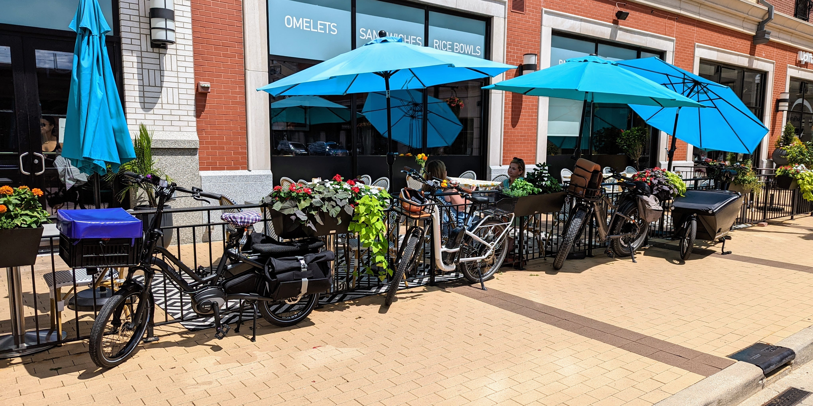
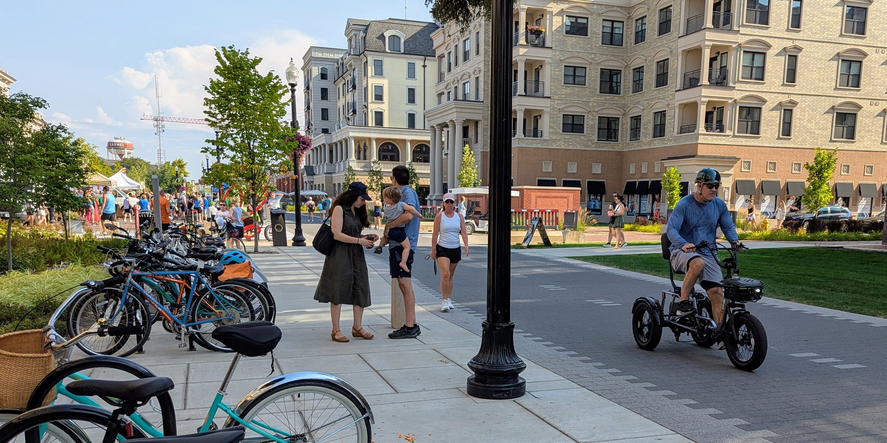
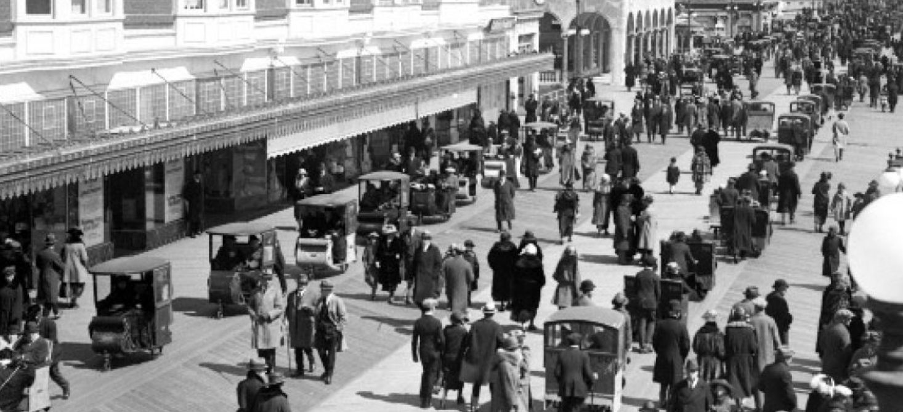
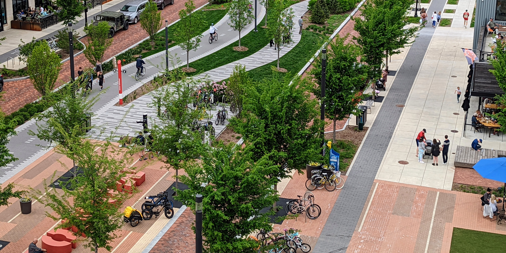

Everyone who lives in Carmel should support funding and building quality active infrastructure: sidewalks, [multi-use paths](/blog/the-autumn-greenway/), raised crosswalks, protected bike lanes, secure bike parking, and more green space.

Why? Because having alternatives to driving benefits everyone, including drivers. Every person who chooses to walk or bike is one less car circling a roundabout, looking for a parking space, and creating congestion, which wears down the livability of our city.

Parents benefit enormously from [good active infrastructure](https://www.strongtowns.org/journal/2024/10/3/do-bike-lanes-reduce-congestion-is-the-wrong-question). How many times have your kids asked to go somewhere and you’ve had to drop everything to play chauffeur, even for something just a mile or two away? Wouldn’t it be better if Carmel invested in safe, efficient, and enjoyable infrastructure that allowed your kids to move independently? Letting them bike to a friend’s house, walk to school, go to the Friday night football game, or grab ice cream downtown without relying on you. When infrastructure is designed to protect and prioritize children, parents feel more confident stepping back, and that creates more time and freedom for everyone. We hear a lot about the future being about autonomous cars. Healthy cities give us something better, they give us more autonomous kids.

Small businesses [benefit](https://www.strongtowns.org/journal/2018/1/16/why-walkable-streets-are-more-economically-productive) from quality active infrastructure too. When streets are safe and easy to navigate on foot or by bike, people are more likely to shop locally instead of driving to the outskirts to spend at a big box store. Bike parking in front of a business is more effective than street parking because it keeps the storefront visible. No one impulse shops when your window display is hidden behind a massive SUV. People who are walking or biking are more likely to spontaneously stop and shop as they travel. That’s something car-focused streets will never offer.

<figure class="figure">
  
  <figcaption class="figure-caption text-center">Bikes lined up on the sidewalk</figcaption>
</figure>

Infrastructure that works for everyone needs to be safe, direct, and separated. When we get this right, we don’t just invite people in, we enable them. Kids can move through their city without being driven everywhere. Older adults stay active and connected in their own communities. People with mobility challenges have clear, predictable pathways. It creates comfort and freedom for everyone, regardless of age or ability.

And this isn’t a fantasy. My household lives this way. We moved to Carmel specifically for this. We own a car, but it sits in the garage most of the time. We do almost everything on e-cargo bikes. Grocery runs, haircuts, dinner out, the gym, the hardware store. Not only is it easy, it’s beneficial. We get movement passively built into our lives. We get fresh air and sunlight. We save money. We engage with our surroundings more than we ever could behind a windshield. And we feel safer on our streets because of the infrastructure Carmel has already built.

<figure class="figure">
  
  <figcaption class="figure-caption text-center">The Monon Trail provides safe and low-stress access to local businesses</figcaption>
</figure>

What’s troubling is how biking and walking have been reframed in modern American life. These were never meant to be recreational activities. They were forms of transportation. Our towns and cities didn’t thrive because everyone drove everywhere. People had the freedom to walk and bike locally for daily essentials. Exercise was baked into life because movement came with getting things done. You didn’t need to say “I’m going for a walk to get some exercise.” You just walked to the [corner store](https://www.strongtowns.org/journal/2016/8/25/in-praise-of-the-corner-store). You moved because your city allowed you to. That freedom was lost, but it’s something we can restore.

<figure class="figure">
  
  <figcaption class="figure-caption text-center">A crowd bustles across the Atlantic City Boardwalk in 1923 on Palm Sunday. nydailynews</figcaption>
</figure>

Carmel’s infrastructure is what sets it apart. Decades of work got us to where we are now. It would be a mistake to stop here. If someone wants to live in a place where car dependency is the only option, there are thousands of cities in the U.S. to choose from. But Carmel has shown it can be different. It can be better.

Sometimes, in certain parts of town, Carmel reminds us of the places we love to visit. The places we vacation in because they are quiet, walkable, full of life, filled with shade and laughter and human interaction. You hear birds and people instead of traffic and engines. That’s not an accident. That’s the result of intentional design.

<figure class="figure">
  
  <figcaption class="figure-caption text-center">Carmel has world-class intentional design on Monon Boulevard</figcaption>
</figure>

Active infrastructure makes our city healthier, safer, more beautiful, and more financially sustainable. It costs less to build and maintain than car infrastructure. It reduces injuries and deaths. It keeps people engaged in their communities. It gives us transportation freedom without burdening our wallets or our environment. When we expand that network with tree canopy, green space, lighting, and smart design, Carmel doesn’t just stay attractive, it becomes a model for how American cities can evolve.

We are not just adding a few bike lanes, we are shaping our city’s future, and it’s one worth investing in.

*I'm Brandon Lust -- Carmel resident since 2021. Follow me on [Bluesky](https://bsky.app/profile/americanfietser.com) and [YouTube](https://www.youtube.com/@AmericanFietser).*