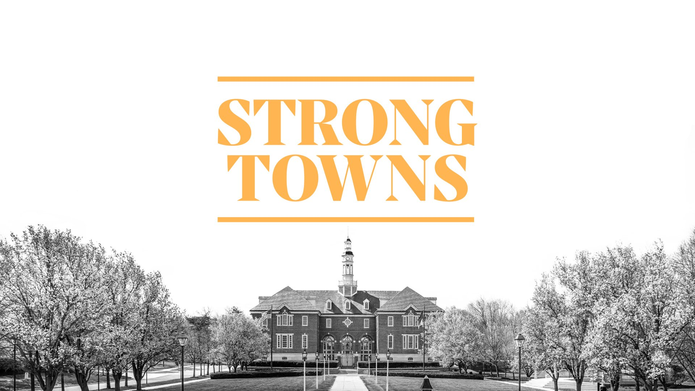

_This was originally published on [dakotacrawford.com](https://dakotacrawford.com). It has been reposted here with permission from the author._

A small group of passionate advocates is building a [Strong Towns Local Conversation](https://www.strongtowns.org/local) in Carmel, Indiana. Maybe you’ll join us?

The Strong Towns team has [talked at length about Carmel](https://www.strongtowns.org/journal/2018/11/5/carmel-is-not-a-strong-town) over the years, so maybe it’s no wonder this group is taking shape organically. If you’ve researched housing and building with purpose, you’ve probably found a Strong Towns piece or two on Carmel.

We’re excited to grow this group and make Carmel a little Stronger, one advocate at a time!

---

What if every member of Carmel’s community could find an affordable home?

Imagine a Carmel in which the service workers who drive our local economy could actually afford to live. This would reduce rush hour traffic and bolster our small businesses. Recruiting and retaining workers in a place that’s unaffordable is an uphill climb.

Picture, too, a place where senior citizens who are planning to downsize from single-family homes actually have options to downsize *to*. And where parents of Carmel High School graduates can hope that their children — at least on the basis of affordability, if not proximity to mom and dad — are free to move back to Carmel and start their own families.

If you’re interested in working toward this version of Carmel, maybe you’ll join Strong Towns Carmel. We advocate for policies that make it easier to build backyard cottages, a bottom-up way to provide housing for our senior community. We support housing solutions that ensure our city finances aren’t over-extended by sprawl. Above all, we strive for collaboration with local leadership to build a prosperous place.

It’s an important time to get involved. Just as we officially formed this local extension of [Strong Towns](https://www.strongtowns.org/about), the national non-profit that promotes financially strong and resilient development patterns, Carmel leaders are dialing in their focus on housing.

The Advisory Commission on Housing held [its first public meeting April 24](https://www.youtube.com/watch?v=p5rpFcRDiWM). Over the course of 45 minutes, the group outlined plans to build on learnings from the city’s seven-month Housing Task Force, which concluded last September. Some directives laid out in the task force’s final report are aligned with [the Strong Towns vision](https://static1.squarespace.com/static/53dd6676e4b0fedfbc26ea91/t/627aae62e24d6669f6496002/1652207205056/Strong+Towns+Strategic+Plan+%28WEB%29.pdf).

For example: “Facilitate Development of Missing Middle Housing,” is an objectively good and important place to begin, but this is only one of the task force’s 13 guidelines. Also on the list is providing more green space, finding balance on single-use apartment projects and striving to “Protect Existing Single-Family Neighborhoods,” among other priorities.

Each of these holds its own virtues, but there will be give and take. City leaders will consider input from residents with conflicting interests. There will be limitations due to outdated zoning and parking requirements. Developers and realtors will propose imperfect projects. We’ll run out of land. The list goes on.

There are a bunch of tough questions and no perfect answers. If you’re still reading and thinking: “I want to help find the best possible answers,” then join us. Help shape our city from the bottom up so that it is safe, prosperous, and attainable for all.

*Reach us at [strongtownscarmel@gmail.com](mailto:strongtownscarmel@gmail.com).*