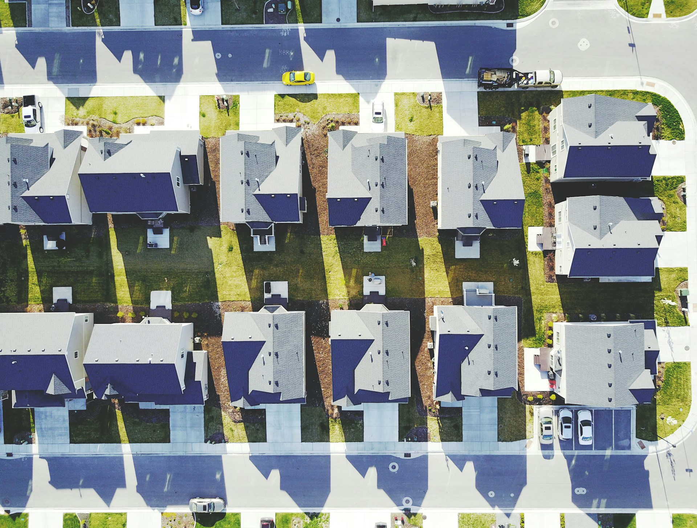
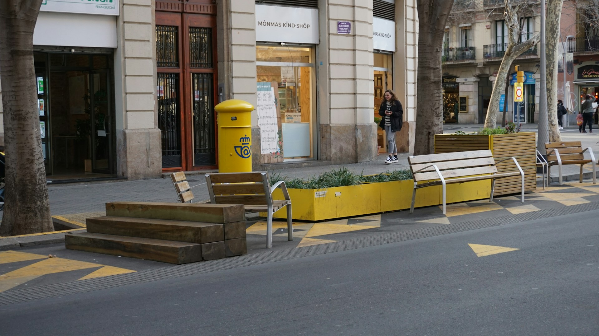
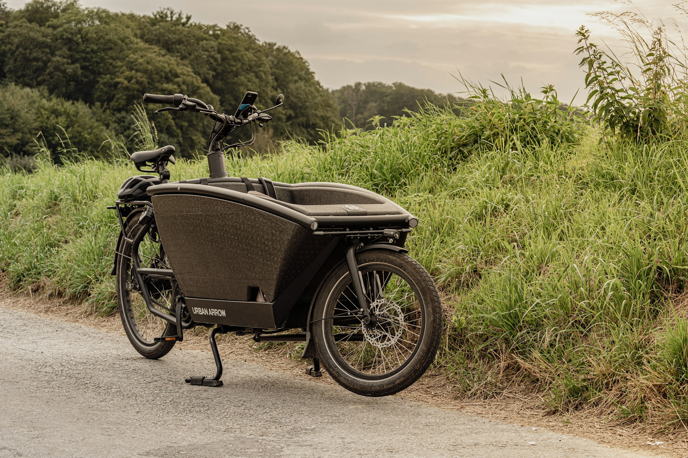
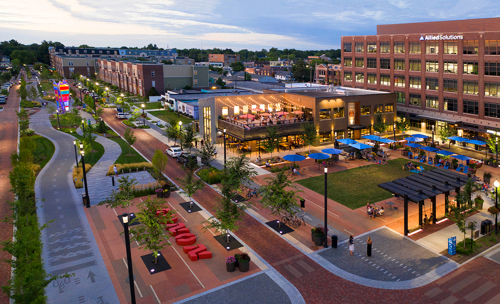

I was recently invited to speak about Strong Towns Carmel on the [Atlast Wild podcast](https://open.spotify.com/show/1ajKXrGCZ1k1THOdFhuRqw?si=3d1906438c7a42df) hosted by Brian Thibodeau. 

<iframe data-testid="embed-iframe" style="border-radius:12px" src="https://open.spotify.com/embed/episode/4doTiXY3SvZNWPQIeFSitw?utm_source=generator" frameBorder="0" allowfullscreen="" allow="autoplay; clipboard-write; encrypted-media; fullscreen; picture-in-picture" loading="lazy"></iframe>

_The following is a version of the transcript, edited to improve readability and clarity._

---

**Brian:** How do you explain Strong Towns to people who've never heard about it before?

**Jordan:** I'd say Strong Towns is a grassroots movement that brings together people who want to make their city or town better. That's the of the heart of it. Our local group is interested in making walking and [biking](https://strongtownscarmel.org/tags/bike-lanes/) safer and accessible to more people, and bringing more [housing options](https://strongtownscarmel.org/tags/housing/), especially more affordable housing, to Carmel.

Generally just making it so that more diversity can exist in our city, whether that means more local coffee shops, more people, different incomes. Those are the kind of things that make cities more resilient, interesting, and a better place to live.

**Brian**: Amazing! So what is your role with Strong Towns?

**Jordan:** Strong Towns is a national nonprofit, but they have this thing called [Local Conversations](https://www.strongtowns.org/local) — I helped start one in Carmel earlier this year. There's not a lot of bureaucracy or structure. We try to meet monthly and have done a few volunteer events helping out other local nonprofits (like [HAND](https://handincorporated.org/)). We're just getting started and figuring everything out.

**Brian:** How did you first learn about Strong Towns and why did you want to get into it yourself?

**Jordan:** I’ve followed [Charles Marohn](https://www.strongtowns.org/contributors-journal/charles-marohn), who started the organization, for at least 5 or 6 years now. People call it being [orange-pilled](https://www.reddit.com/r/notjustbikes/comments/10v89ah/orange_pill/) (because of [Not Just Bikes](https://www.youtube.com/channel/UC0intLFzLaudFG-xAvUEO-A)) or urbanism-pilled, mostly from YouTube. [CityNerd](https://www.youtube.com/@CityNerd) is another good example. It’s this sphere of people promoting walkable and bike-able, people-oriented places that we see the need for all across America, and really, the world.

I loved the ideas Marohn talked about with Strong Towns for a long time and I was excited to finally put them into practice. There’s a lot of American cities that look like they’re growing and flourishing to some extent, when in fact they’re struggling financially. It became especially obvious after the housing crisis in 2008 — there are a lot of cities that have depended on this idea of continuous growth. Strong Towns calls it the “[growth ponzi scheme](https://www.strongtowns.org/journal/2020-8-28-the-growth-ponzi-scheme-a-crash-course)”. The idea is you just keep building new housing developments, which bring in tax revenue, and you keep doing that forever. But those require a ton of infrastructure — you’ve got streets, sewer, water, fire and police department coverage. Everything gets stretched thinner and thinner. That’s fine at the beginning, when everything is new. Over time, the infrastructure needs to be maintained and replaced, but you’re not getting new sources of income without building. Maybe the land value goes up a little, but it won’t be much with suburban sprawl. Instead you end up with a downward spiral: having to support more and more housing developments with services but not getting the tax income to balance it.

**Brian:** What is your perception of Carmel? What are we doing right? I’d love to hear your perspective and some of the goals you might have.

**Jordan:** I could have moved almost anywhere, but our family choose Carmel specifically for the downtown and all the events and things happening there. In general, Carmel is a very typical suburb, especially once you leave downtown. But within the core, they’ve done a lot of very interesting development that I would say is unique.

After World War Two, there was this change in how we developed neighborhoods in the US. We came back from the war, were successful, we had all this manufacturing built up, and then we started expanding the highway system. We started focusing on this idea of suburban living, away from where you worked and commuting in by car. We had the GI Bill to help build housing. It ended up creating this sprawl that is ubiquitous across the American landscape.

<figure class="figure">
  
  <figcaption class="figure-caption text-center">Suburban sprawl</figcaption>
</figure>

Carmel, like a lot of post-war suburbs, is a town that grown up after all that happened. So while we had a train station, which the Monon is named after, it wasn’t a streetcar suburb like those outside of Chicago or Philadelphia. When Mayor Brainard came into office, there wasn’t much of a historic downtown, but he was inspired by what he saw in Europe and wanted to recreate some of it in Carmel.

So we have this spine of the Monon Trail, which is a multi-use, [off-street path](https://strongtownscarmel.org/blog/why-off-street/) through the entire city that goes from our neighboring cities in the north like Westfield, all the way to downtown Indianapolis to the south. Around that there’s mixed-use development with apartments, condos, restaurants, and shops — all accessible by bike or by walking. I moved here so I could experience that without needing a car.

**Brian:** I've seen you and your family embrace that in a really inspiring way. You guys just walking to everything, biking to everything, and really trying to support the things that are within that kind of range.

**Jordan:** That is the cool thing about the Monon. You can ride it to downtown Indy if you wanted. It's very, very accessible.

**Brian:** Why did we take that turn as a society after WWII? We were selling kit homes out of a Sears catalog. We were building tons of tract houses. What was the realization that this probably isn't the best way forward and what's the pivot?

**Jordan**: I think we're still in that pivot. Many communities have made the realization to some extent, but lots of places are still behind, still focusing on car oriented infrastructure. In the post-war period, there was this vision of an amazing prosperous future where cars would create freedom. We could live wherever we wanted and still drive to work. We could have cities full of massive skyscrapers where we did all the productive things, but then surrounded by acres and acres of parks. Cars helped facilitate that vision. Instead of having the space between your house and work be filled with grime and dirt and possibly even poor people, you could fill it with beautiful parks. That was part of the suburban experiment. A lot of it was racist; white flight — “let’s get out of these scary cities to where it’s safe” and cars enabled us to do that.

I think people that don’t normally care about urban planning or how infrastructure is decided on and gets built are starting to come around. They realize how beneficial it can be to live near where you work or shop or take your kids to school. There’s so many benefits, even if you still drive! There’s a statistic from the Department of Energy that said something like 30% of all trips people make are less than a mile away from home. People just want to go to the closest coffee shop, not drive 20 minutes away. But people are still driving because cities have been designed around cars. It just feels more comfortable and safe to drive. That’s the easiest way to do things.

Places like Carmel, and they started with the Monon Trail, have realized that when you get people out of cars they can live more active, healthier lifestyles. New Yorkers walk everywhere and that contributes to staying healthier because physical activity is built into their daily life.

Also, walkability is more affordable for cities, which is a Strong Towns thing. Cars are heavy and they put a tremendous amount of wear and tear on public roads. It costs a lot of taxpayer money to constantly fix, which we see is a huge problem in Indianapolis — they’re constantly behind trying to fix pot holes. That’s because cars damage the streets. We continue to make them heavier. EVs don’t help — the batteries make them even heavier. So there’s financial benefits to orienting a city around walking, biking, and transit. You can get more people around the city without as much costly infrastructure.

It's interesting to see now there's a trend of authentic, non-corporate, urbanist content on social media. People are just going outside, seeing problems in their neighborhoods, and filming it. They’ve putting it all together in this slick marketing package that describes why it got this bad and how we can improve it. More people are waking up to these ideas and saying they want more bike lanes, they want to be able to ride a bus to the park. People want these things.

**Brian:** How much of this story do you think evolved post COVID? Do you think that was a catalyst for some eyes opening and some minds opening?

**Jordan:** Absolutely! There's a really good book called [The High Cost of Free Parking](https://en.wikipedia.org/wiki/The_High_Cost_of_Free_Parking) by Professor Donald Shoup. It's kind of revered by anybody into urban planning. In it, Shoup talks about how we have all this extremely valuable land in the center of our cities. That’s millions of dollars we’re dedicating to the storage of cars. A lot of cities solve that by charging for parking, because it’s an in-demand product.

During COVID, we all came to realize that there’s this space we’ve been using for car storage that we could instead be using for outdoor seating at restaurants or just space to sit outside. This is space in our cities we could be using right now. They closed streets even and we realized we have all this extra capacity for making third spaces that are more enjoyable to be in as a person.

<figure class="figure">
  
  <figcaption class="figure-caption text-center">Parklet in Barcelona - photo by <a href="https://unsplash.com/@mareklumi?utm_source=unsplash&utm_medium=referral&utm_content=creditCopyText">Marek Lumi</a> on <a href="https://unsplash.com/photos/a-row-of-benches-sitting-on-the-side-of-a-street-1br6hwYze1E?utm_source=unsplash&utm_medium=referral&utm_content=creditCopyText">Unsplash</a></figcaption>
</figure>

**Brian:** Imagine a parking lot just turning into green space. That could be so brilliant. How much of the COVID experience was part of your transition into becoming passionate about this? Or did that happen before? And if So, what can you tell me kind of about those experiences that you had, whether those being travel or and just educating yourself, social media, you know, whatever.

**Jordan:** We've always moved around a lot, just because we've had the flexibility. I'm a software developer, so I could work from home long before COVID. Between that and my wife's ADHD, we just really loved trying out new places. Before and during COVID, we lived in downtown San Diego. We ended up moving to rural Washington state partly as an escape from the city. We have a young daughter and wanted to walk and bike everywhere with her, but didn’t feel safe because the city is so oriented around cars. Not to mention the issues with homelessness. You have unhoused people in the streets and it didn’t feel safe for them or us. So there were a lot of issues that made us want to escape to a small town out in the woods.

That's how I grew up. I love all the aspects of small town living: being close to nature, being able to walk around and feel safe walking and biking places because there's not very many cars. But I also love cities! I love being close to people with different interests — cities by their nature can support more unique businesses and restaurants. You're not going to get some cool new El Salvadorian restaurant in your small town. You're not going to get the same kind of crazy record shops in small towns. So I love both types of living. After that we wanted something kind of in the middle, which is why we moved to Carmel. It has a small town feel, even though there’s 100K people. It’s got the amenities of a much bigger city.

**Brian**: That's brilliant. I love that experience of going from a big city to something totally  opposite. That's what gives you so much, dare I say “street cred”, because you have this breadth of experience. You're not just speaking from what one might have learned on YouTube. So I have a lot of respect for your experience and that you have put it into action by joining Strong Towns and representing them here in our community.

I already see you making a difference. You’re speaking with so many different types of folks that are trying to make good changes here. Going back to the Monon Trail and walkability/bike-ability. Can you speak to your vision for a bike trail, a walking trail or whatever is on your mind?

**Jordan**: The Monon is setup and marketed as a place for exercise and recreation. It's a place you go to do your morning run or hang out with the family on the weekend — bring your bikes on your truck then park and ride the trail for a few miles. And, and that's awesome! But for me, I've always seen biking as a means of transportation. I don't do like bike races. I don't wear spandex. I try to avoid getting sweaty. I use bikes as a means to get around because it's more fun, it's more enjoyable. I get to experience the city. I can see things that I wouldn't see when I'm flying by at 30 miles an hour. I can hear the birds. If I see something interesting, I can just stop and pull over and check it out. Also there's environmental improvements and impacts by avoiding car usage. When I take my daughter to school or dance lessons, I get to talk to her and she gets to see all the same things I'm seeing. She's not heads down on her phone or whatever.

**Brian:** Can you describe your bike? You have this cool seat situation — it almost feels like one of those motorbikes with a sidecar.

**Jordan:** It’s called an Urban Arrow. It’s a cargo bike. There are a bunch of different ones, but instead of the more common long-tail bicycle in America, where you have an extended rear-end where you put child seats, behind you; this one is more in front. It’s basically a wheelbarrow. Having that huge bucket up front and down low is great because I can put 200 pounds in it easily and it doesn’t feel any harder to steer.

<figure class="figure">
  
  <figcaption class="figure-caption text-center">Urban Arrow bicycle - photo by <a href="https://unsplash.com/@robertschwarz?utm_source=unsplash&utm_medium=referral&utm_content=creditCopyText">Robert Schwarz</a> on <a href="https://unsplash.com/photos/a-motorcycle-parked-on-the-side-of-a-road-IhwC9VX3LoY?utm_source=unsplash&utm_medium=referral&utm_content=creditCopyText">Unsplash</a></figcaption>
</figure>

**Brian:** Could you take me around town?

**Jordan:** Yeah for sure! My wife rides in it.

**Brian:** I’m right at 200, so I’m just right.

**Jordan:** That’s the limit, so you’re going to have to do some workouts! No, I actually don’t even know what the limit is. It’s pretty high. It’s great though because it’s similar to a car, the freedom of a car, because if I want to run some errands I don’t have to think about how much I can fit in it. I just throw whatever in there; a bunch of groceries. I don’t have to worry. I can pick up any package. I can do all that stuff. It helps alleviate some of the anxiety that you normally have on a bike trying to run errands.

**Brian:** So going back to cycling as a means of transportation. You don’t need spandex. What are your thoughts on electric bikes and scooters? I have my own opinions on that. When I see kids out there riding these electric bikes, I'm just thinking: there's no exercise happening in that moment. I get it for like some longer distances and convenience, but we've taken a good thing and we've made it into this lazy pastime. I'd I'd love to hear your thoughts.

**Jordan:** That's a good point. We have a city councillor, who is a doctor and she basically said a lot of the same things. The city council is crafting legislation right now that will govern these devices and how they get used, how fast they can go, who can use them. The health aspect is a part of that. The city councilors want to encourage more active transportation like regular bikes.

**Brian:** When I used to work downtown, it was the scooters that were a new thing. All these electric scooters just became like a graveyard of abandoned e-scooters. It was the saddest thing. I wanted to make a documentary of the sad state — like the scooter thrown over the bridge into the the shallow water. You're walking, you're tripping over these things. So yeah, there’s pros and cons.

**Jordan:** The way I look at it, going back to the idea that a bike isn’t just for exercise or for fun — although it can be. But those are just bonuses. For me, it’s a means of transportation and so when I look at kids using e-bikes and scooters, I think about it in terms of replacing a car trip. Electric devices facilitate that, because of the extended range. I know I can go an extra 10 miles or whatever because I don’t have to peddle the whole way — again, I don’t have to get sweaty. And it’s faster; it’s not going to take me 30 minutes to get somewhere. So those devices enable that and help replace the need to take a car.

I also see benefits for kids being able to gain independence. If they’re under 16, they normally have to wait for their parents or someone else to drive them. So a lot of them just won’t go. They’ll stay home and play video games instead. They can talk to their friends on Discord. While yeah, it would be great if they were all biking for exercise when they meet up, but I think if the alternative is them sitting at home or waiting for a car ride, to me that’s a win. I’m all about encouraging mobility however you want to get there, especially if it’s not in a car.

**Brian:** I love that. And I think as e-biking becomes more normalized we’ll need to teach more responsibility around it. When we were kids, there were basic rules: wear your helmet, don’t ride on the sidewalk, things like that. But with all the new types of bikes, people aren’t always sure what the rules are. Like, is it a regular bike? Is it a motorbike? I’ve even heard people say things like, “If that e-bike can go that fast, it shouldn’t be on the Monon. It could hurt somebody.”

**Jordan:** That's exactly what Carmel and cities across the United States are working on right now. But first they have to define what a micro-mobility device is; like what’s the difference between a scooter and a unicycle that’s powered versus a motorcycle versus an e-bike with a throttle, etc. All these things require definition in order to define what's allowed and what's not.

**Brian:** I agree with your assessment of the trade-offs.

**Jordan:** I see it as a good problem to have because it’s a problem of popularity. We have so many people wanting to use the Monon and other bike paths that they’re in conflict now. We have people walking that are in conflict with the people on e-bikes who are riding too fast and that’s a good problem to have. To me, that’s a problem we as a society and city should want to have and to solve without destroying the popularity. I don’t want people to be forced back into cars because they can’t ride their scooter. I want to figure out how we can get more space for people to walk and bike together.

**Brian:** I want to see more rollerblade zones — just way more rollerblading!

**Jordan:** There’s at least one person in Carmel still using rollerblades; they’re keeping it alive.

**Brian:** Talk more about your idea for a map or some way for residents and visitors to explore the city by bike.

**Jordan:** Hamilton County tourism has a website and a map they’re calling the “[HamCo Hubway](https://www.visithamiltoncounty.com/things-to-do/outdoors/trails/hubway/)” and it’s basically a map of all the major bike routes that exist in the county, like the Monon trail and 106th in Carmel, then out to Noblesville with the Nickel Plate trail. There’s this network of off-street trails that are pretty great for getting around the whole county.

The map is one thing, but I want to create a guide for both living and visiting Carmel car-free. People have done this for various other cities. It’s easier in places like Chicago or NYC because of public transportation, but Carmel has become a bit of a destination for people to visit and ride their bikes. I think people would love to see all the tourist spots, great restaurants, and Main Street — all right off the Monon; by bike. You can even ride down to Broad Ripple! The bike share here in Carmel is pretty cheap: [$1.50 per 30 minutes](https://www.tandem-mobility.com/carmel-bike-share). There’s a lot of stations around. We have this great asset, which I think they city does an okay job promoting it, but Carmel isn’t necessarily recognized as a bicycle city like Portland, Minneapolis, or Boulder are. Carmel already has a lot of great infrastructure but we have to do a better job aligning with the image of a bike-city to really get on that list.

**Brian:** Right, we have created this walkable and bike-able city, plus we’re supporting local businesses instead of giant corporations, so Carmel could be an eco-tourism destination. People want to experience that kind of thing. No one wants to go to Santa Fe and eat at Chilis. We lose our culture when we give it up to big corporations.

**Jordan:** Absolutely. Building density, like Carmel has in Midtown, enables local businesses to survive despite this being a suburb, because there’s a cluster of people and traffic around an area. The alternative would be a strip mall somewhere far off that’s hard to get people to come out and shop at. But if you have a bunch of people already out, they’re also going to stop at Sun King, the local brewery; they’ll walk over to grab sandwich at Garden Table, etc. Midtown Plaza is effectively a third space, with a playground and a place to have fun for free — but of course with the option to give your money to local businesses.

**Brian:** My wife runs a [dance studio](https://www.theballetstudiocarmel.com/) in the Arts and Design District (near Main St Carmel, near Midtown Plaza) — we were very intentional about choosing that location and it’s been exactly like you described. Third spaces are vital for our community. If we were in an industrial park, which is more affordable, people would have to drive and so they’d probably go gas up and run errands at Walmart and some home goods store instead of walking around locally. We’re so grateful to be in that ecosystem that does help other businesses that surround us and vice versa.

I love Midtown. I love the outdoor games that they have: pool tables, ping pong, bocce ball, corn hole. Why do you think this has been such a success?

**Jordan:** Going back to your wife’s dance studio — that has become our anchor (we’re there almost every day of the week) and so we want to stay within walking distance. But also so we can go to all these local places without having to drive. That’s part of why we moved to Carmel.

The third spaces in Carmel are so good because of world-class design. Midtown was designed by [Jeff Speck](https://www.speckdempsey.com/projects/monon-boulevard), an architect and urban planner who’s been designing great places around the country for decades. He’s written books about it! Also Gehl Architects also helped with the design.

If you imagine a normal street where cars are driving 20-30 MPH, you don’t feel safe walking in the middle of the street on a day when there’s traffic. You stay on the sidewalks, wait to make sure it’s safe to cross, and you get across as fast as possible.

Midtown, because of the design, is a place that people feel safe letting their toddlers play within 5 feet of cars. That’s because it’s a space that’s oriented around people; cars are the foreign objects in that area. Drivers feel a little anxious while driving there because of all the activity. Plus there’s brick pavers instead of asphalt, so it’s not a smooth drive; it’s a little bumpy and you can’t drive too fast. It’s very narrow too.

<figure class="figure">
  
  <figcaption class="figure-caption text-center">Monon Boulevard in Carmel, Indiana</figcaption>
</figure>

**Brian:** It feels like you’re driving on the sidewalk and you’re like “is this okay?”

**Jordan:** Exactly! People drive slow and cautiously because they’re constantly looking around. All these design choices make it a space that feels safe to be outside of the car, despite being surrounded by cars, because drivers are forced to be careful. So people are willing to bring their kids and hang out like any park or playground, because they’re not constantly on edge that the kids are going to run out into traffic.

**Brian:** That’s amazing. I didn’t know any of that, but I see the truth in it, just from the experience of being there. It’s a visceral feeling when you’re driving in that area. That’s the power of urban planning. What's the biggest branding challenge that Strong Towns is up against?

**Jordan:** Strong Towns at its core is a bottom-up, grassroots, incremental movement. It's in response to top-down planning, with huge investments by large organizations, whether it's governments or corporations, deciding to level areas and rebuild these massive developments. The typical examples like conference centers and stadiums are these multi-million (or even billion) dollar investments that are huge risks.

**Brian:** There's a whole other conversation too around new builds versus revitalizing, which we can talk about later, but I just wanted to call that out.

**Jordan:** Yeah, Strong Towns is talking about the idea of starting small, listening to people, and keeping everything localized. There’s a lot of ideas and solutions that your city can implement, but you have to listen to your residents and city councillors and everything else to figure out what is the right thing for your town. So it’s hard to have a singular marketing or branding that applies to every city. Unlike say [YIMBY](https://en.wikipedia.org/wiki/YIMBY), which is focused on a single aspect: housing, Strong Towns includes housing and safe streets and fiscal responsibility.

**Brian:** Something I read in [Made to Stick](https://en.wikipedia.org/wiki/Made_to_Stick) is that you should say three things, then say nothing. So yeah it’s a challenge when you have a lot more than that to say.

**Jordan:** That’s a great book! The other issue is that Strong Towns is all about slow growth, to avoid risky investments, like adding the next level of density to a neighborhood instead of replacing it entirely; an ADU here, a duplex there, etc. That creates resiliency, but it takes time.

**Brian:** To sum it up: how does Strong Towns Carmel move into the community with purpose and clarity when we have these multifaceted objectives?

**Jordan:** And how do we incorporate the community into that vision? Most of us in the group today want bike paths, and bus stops, and light rail everywhere, but that may not be what everyone else wants. We have to work together to find a solution that solves our problems and makes this place better for everyone. That requires a lot of compromise, negotiation, and listening. It’s a long haul to ensure it’s done right.

**Brian:** What’s something the land or the town has taught you?

Jordan: I’ve learned that the city council isn’t my enemy. So many people here want the same things that I want and are working towards the same goals. I’ve been to many city council meetings, met with city engineers, talked to locals, and people at the city are saying and doing (mostly) the right things here. But it’s a process that requires convincing everyone and making sure we have the money to build it all without taking huge risks. It’s a work in progress.

**Brian:** Thanks for being on the podcast! Atlast Wild is more than a podcast. It’s a branding studio and creative platform for regenerative storytelling and eco-tourism. Because when we tell better stories, we build better places.

---

_**I’m Jordan Kohl**, Carmel resident, Strong Towns Carmel volunteer, and an advocate for walking and biking. You can follow me on [BlueSky](https://bsky.app/profile/simpixelated.bsky.social) or my [personal website](https://simpixelated.com/)._