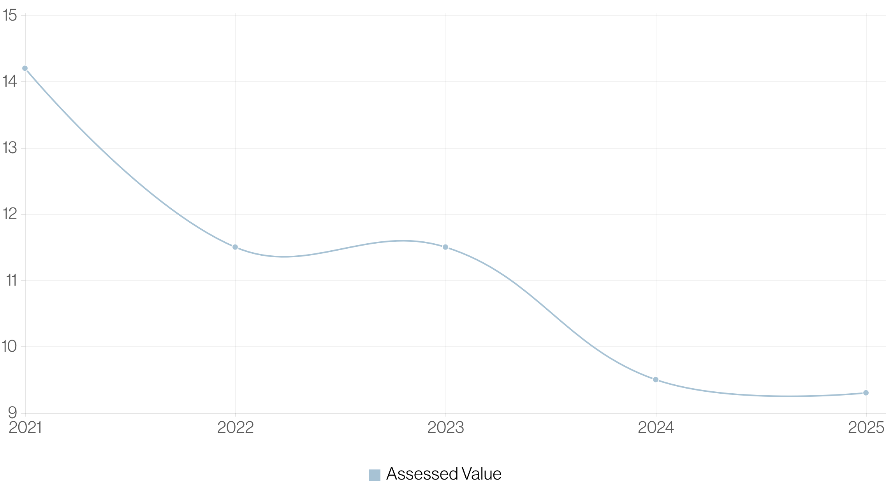

_This was originally published on [dakotacrawford.com](https://dakotacrawford.com). It has been reposted here with permission from the author._

Carmel’s “Meridian Corridor” is struggling.

In December, Current Publishing [highlighted](https://youarecurrent.com/2024/12/15/seeking-a-spark-city-of-carmel-considering-ways-to-revitalize-redevelop-meridian-corridor-economic-engine/) the once-thriving business district’s 22% percent vacancy rate. City leaders blame some combination of a post-pandemic shift toward remote work and lacking amenities near the cluster of corporate campuses.

Since more modern offerings around Carmel reportedly have a much lower vacancy rate of 2%, redevelopment might help recoup the corporate tenants whose taxes historically made possible TIF-based funding of bold public projects like the Palladium.

The TIF (Tax Increment Financing) approach has been a go-to tool for Carmel. It allows the city to issue bonds that finance infrastructure improvements within a specified district. As those improvements generate tax revenue through increased property values, the net new revenue is used to pay off the bond. It’s a confusing but shrewd approach that [the Current broke down earlier this year](https://youarecurrent.com/2025/04/02/a-less-taxing-approach-carmel-embraces-benefits-of-tif-for-major-redevelopment-efforts/).

And while city leadership maintains that Carmel is in a favorable position to pay off current TIF bonds, Mayor Sue Finkham underscored the need for a strong Meridian Corridor to protect taxpayers.

“Because those tax revenues support our big TIF,” Finkham told the Current, “it’s of prime importance to us to make sure those revenues stay strong, so the residential taxpayer doesn’t have to make up the difference.”

# What’s Wrong?

<figure class="figure">
  
  <figcaption class="figure-caption">Parking spaces along the Meridian Corridor are highlighted in red. This infrastructure stifles the business district.</figcaption>
</figure>

Empty parking spots are easy enough to overlook if you’re not thinking about them as a resource — as potentially valuable real estate that could support a stronger, more sustainable Carmel.

But once you notice them, it’s tough to unsee. Visit the Meridian Corridor at 2 p.m. on any given work day and you’ll quite literally feel heat waves radiating over acres of wasted asphalt that make [our community hotter and more susceptible to floods](https://www.scientificamerican.com/article/parking-lots-cause-more-heat-and-flooding-heres-how-100-u-s-cities-rank/). You’ll start wondering what value the spots might generate for our community if replaced by a local business, shopping center or some other amenity.

Mike Hollibaugh, Carmel’s Director of Community Services, has alluded to the need to inject some vibrancy.

“Amenities would be in the form of public space, plaza and green space, not unlike Midtown, and having walkable destinations that can be shared with residents,” [he told the Current](https://youarecurrent.com/2024/12/15/seeking-a-spark-city-of-carmel-considering-ways-to-revitalize-redevelop-meridian-corridor-economic-engine/). “Whether we’re introducing housing is part of that, too, more than likely that would be the case. But these public amenities would be open to really anyone.”

# A Big Vacancy & Opportunity

<figure class="figure">
  
</figure>

This pitch’s focus is a for-sale, 78-acre campus owned by Washington National, an insurance company within the CNO Financial family. It has been vacant for roughly a year, [when CNO Financial relocated to a new campus, also in Carmel](https://www.wishtv.com/news/business/developers-delight-massive-cno-financial-site-in-carmel-is-up-for-sale/).

Though leaders like Finkam and Hollibaugh have shared broad thoughts on the Meridian Corridor, there is no public redevelopment plan yet for this specific property.

In the meantime, its assessed value falls, highlighting the revenue concerns Finkham shared in December. One parcel within the campus (530 College Dr.) saw its tax value fall by nearly 45 percent from 2019 ($950,000) to 2025 ($532,040).

## 530 College Dr. Assessed Value (In Millions)

<figure class="figure">
  
  <figcaption class="figure-caption">Interested in reviewing this data? Check out <a href="https://secure2.hamiltoncounty.in.gov/PropertyReports/reports.aspx?parcel=1609350001015000&tab=currentownership">the county assessor’s breakdown</a>.</figcaption>
</figure>

# The Pitch: Culdesac Carmel

<figure class="figure">
  
  <figcaption class="figure-caption">Image of people having a great time, courtesy: <a href="https://culdesac.com/blog/post/experiencing-the-vibrant-community-at-culdesac-first-hand-my-short-term-rental-stay">Culdesac Tempe</a></figcaption>
</figure>

What is a city to do with so much wasted space, built primarily for cars?

Let’s turn the property on its head by partnering with Culdesac, the developer known for bringing to life America’s “first car-free neighborhood.” They tried something ambitious in Tempe, Arizona, building a walkable oasis in the car-centric suburb of 180,000 people.

A 90 percent occupancy rate and [review](https://www.dwell.com/article/culdesac-tempe-car-free-neighborhood-resident-experience-8a14ebc7) after glowing [review](https://www.nytimes.com/2025/03/25/climate/car-free-arizona.html) suggest the bet on walkability is paying off. The development is a work in progress with 288 of 730 planned apartment units complete, but business is already booming and residents are thriving.

# Growing Without Traffic? Win-Win
          
<figure class="figure">
  
  <figcaption class="figure-caption">A great way to reduce traffic? Build up bike-friendly developments. Image courtesy: Culdesac Tempe.</figcaption>
</figure>

Culdesac Tempe offers free transit passes and parking for 1,000 bikes, among other micro-mobility options. In Carmel, where bike infrastructure is well developed, Culdesac residents  could bike to the doctor, grocery store or to visit friends without contributing to traffic congestion.

This is a key point because Carmel is going to keep growing, but its road network is built out and it lacks transit options. That means the most convenient way for most residents to get around is by car. And so, we find ourselves caught in a system that works well until it’s rush hour and your favorite roundabout looks like a parking lot.

The more we invest in walkable, mixed-use developments, the more convenient it will be for more people to take trips without their car. And that is the best way to keep our roundabouts roundabout-ing.

# Efficient Growth & Prosperity

A [Dwell article](https://www.dwell.com/article/culdesac-tempe-car-free-neighborhood-resident-experience-8a14ebc7) calls out nearby economic growth, too, proving that Culdesac’s value isn’t confined to its walkable paseos. As it builds up, so are the nearby neighborhoods that flank a high-speed rail line linking Tempe to Phoenix. Unique, innovative growth has a way of benefiting the entire community.

Not to mention the residents who told the [New York Times](https://www.nytimes.com/2025/03/25/climate/car-free-arizona.html) that Culdesac improved their lives.

### “Long story short, we decided that all the pros outweigh the cons,” Andre Rouhani told the Times. “We do really, really love it here. … It’s the best place I’ve ever lived.”

So Culdesac has driven economic growth, provided people an attractive life and put Tempe on the map in a way most suburban developments could not. But here’s perhaps the strongest argument for a Culdesac Carmel: In a landlocked city that is growing rapidly, we can unlock opportunity by building to the scale of people instead of cars.

Culdesac Tempe cultivated 700+ apartments, 20+ retail sites, walkable plazas, green spaces and more on just 17 acres of land.

The parking lot outside of one nearby corporate property swallows up nearly 14.

<figure class="figure">
  
  <figcaption class="figure-caption">Just one surface parking lot along US-31 could nearly house an entire Culdesac development (700+ apartment units, 20+ businesses, plazas, green spaces and more or … parking. Take your pick!).</figcaption>
</figure>

# The Meridian Corridor of Tomorrow

The Meridian Corridor can’t be redeveloped overnight nor through one project. But the CNO Financial campus, at 78 acres, is big enough to set in motion our move toward an innovative place that is pleasant and, critically, drives revenue through residential taxpayers and corporate mixed-use development.

Culdesac Carmel would provide housing, inviting spaces for local workers and further cement Carmel as a placemaking leader among its suburban peers — all without putting more cars on the road. If flanked by, say, a corporate office, a few cottage courts and a row of townhomes, Culdesac Carmel could serve as a healing stitch, connecting delightful to drab.

<figure class="figure">
  
  <figcaption class="figure-caption">I’ve driven past this area hundreds of times. I used to live just around the corner. I had NO idea how overwhelmingly vast this sea of lifeless parking spots is.</figcaption>
</figure>

***I’m Dakota Crawford**, a housing advocate who has lived in Carmel for five years. I own a townhome in Gramercy West and volunteer with Strong Towns Carmel. I’m a lifelong Hoosier working to make sure Carmel stays safe, prosperous and affordable.*