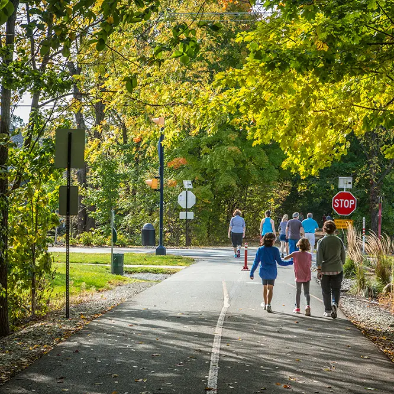

Over the last few decades, Carmel city government has done so much to set Carmel far above the typical suburb in the United States. People are [noticing](https://www.youtube.com/watch?v=XRKdDqcTocA) and moving here to take advantage of the public spaces and infrastructure because they're tired of the grey, sterilized [asphalt deserts](https://strongtownscarmel.org/blog/culdesac-carmel-walkable-city-pitch/) found all across the country, which leave people, by default, car-dependent for everything in life.

As Carmel continues to develop and redevelop our urban spaces and infrastructure, we need to be very thoughtful and mindful of the details. This will result in a network that is welcoming and 
accommodating for all ages and abilities. You already see it with the young, the old, and those who face mobility challenges along The Monon Trail. They flock to where they feel safe.

  <figure class="figure">
    
    <figcaption class="figure-caption">photo courtesy Carmel Clay Parks & Recreation</figcaption>
  </figure>

We must continue this forgiving and nurturing design across our city-wide network to enable everyone to get from point A to B in whichever mode they choose. Since we do not have public transportation yet, it is doubly important that we get our active infrastructure network right so that walking and cycling can be simple, safe, and efficient choices in our everyday mobility.

The Dutch CROW Design Manual for Bicycle Traffic considers five basic [design principles](https://dutchcycling.nl/expertises/cycling-infrastructure/) for building active infrastructure in cities around people:

1. **Cohesion**: Cycling as a means of transport means going by bike from anywhere to everywhere! A cohesive infrastructure ensures a uniformed network. These networks must consider multimodal transport. Thus, the grid of bike lanes has to reduce the number of crossings, and provide links and link alternatives among origins and destinations. 
2. **Directness**: In order to make the most efficient balance between distance and time, it is essential to minimize detours for cyclists. To achieve this, it is necessary to reduce bends, prioritize the cyclist in traffic lights, and make exclusive/separate bike lanes. The goals of these strategies are to reduce journey times and guarantee less physical effort, making cycling a competitive transport alternative. 
3. **Safety**: Good cycling infrastructure design must guarantee both social and road safety. It is necessary to reduce stress and the exposure to pollutants and noise to assure personal health on the road, and specially to attract new people that are interested in cycling, but still concerned and fearful of the conditions. To achieve this, bike lanes work better when they are not parallel to main busy roads, but in neighborhood low speed streets. In addition, bike lanes that are physically separated from the roads will make cycling safer. To minimize the risk of collision, it is also crucial to build tunnels and bridges for intersections with busy traffic and high speed roads.
4. **Comfort**: Looking for comfort is a human instinct. The goal of cycling policy is to make cycling a pleasant experience. To address this, planners have to consider that cyclists are the starting point of the strategies and infrastructure: Normally, bikes have no suspension system, are human operated vehicles, and require a balancing act. To guarantee a comfortable situation, it is imperative to minimize stops and nuisances in the network. Also, it is essential to  make smooth pavements that reduce the vibration and height difference. And finally, to avoid the anxiety of getting lost and optimize the wayfinding, a good and intuitive signing system is necessary.
5. **Attractiveness**: It is well known that an aesthetically pleasant and good quality built environment boosts the cycling activity in an area. This consists of creating green and open areas, in which streets are quiet and well maintained. The presence of vegetation and water attracts cyclists. Therefore, it is imperative to avoid unpleasant conditions when planning infrastructure, such as congested and polluted streets that worsen the safety and health perception.

This short video by the [Dutch Cycling Embassy](https://dutchcycling.nl/) is by no means deeply detailed or all-encompassing, but it gives a broad overview of why the five principles are important and does so in a stunningly visual way:

<iframe width="560" height="315" src="https://www.youtube-nocookie.com/embed/pdsUjjncUp0?si=77nvj5fMQyoCUZyJ" title="YouTube video player" frameborder="0" allow="accelerometer; autoplay; clipboard-write; encrypted-media; gyroscope; picture-in-picture; web-share" referrerpolicy="strict-origin-when-cross-origin" allowfullscreen class="mb-2"></iframe>

The city has worked with consultants like [MobyCon](https://mobycon.com/updates/carmel-indiana-the-roundabout-capital-of-the-united-states/) before and should continue to get feedback and advice from some of the best urban planners on the planet. Let’s keep using the best resources and knowledge at our disposal to set Carmel above and beyond the rest of the US, as we are already well on track to do. Advocates like Strong Towns Carmel and myself are here to help provide any information or connections to help us get there.

*I’m Brandon Lust aka American Fietser (Dutch, 'feet-ser' Meaning: A Person Who Bikes For Transportation). Follow me on [Bluesky](https://bsky.app/profile/americanfietser.com) and [YouTube](https://www.youtube.com/@AmericanFietser).*