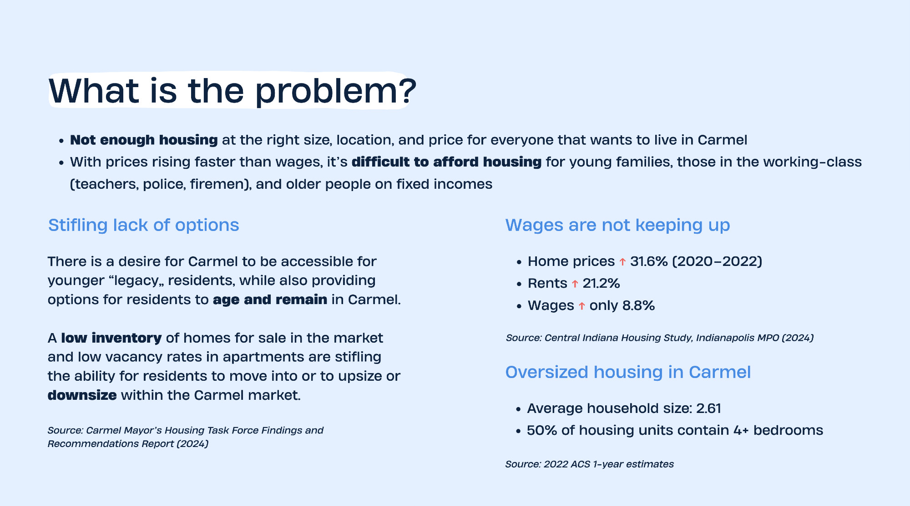
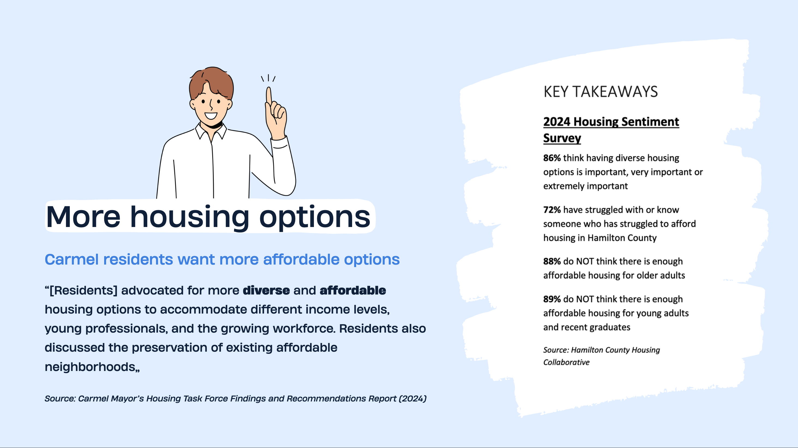
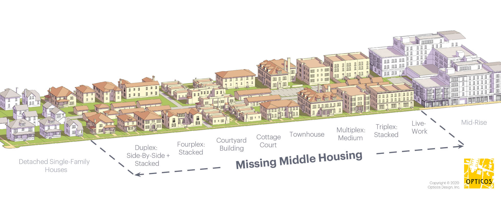
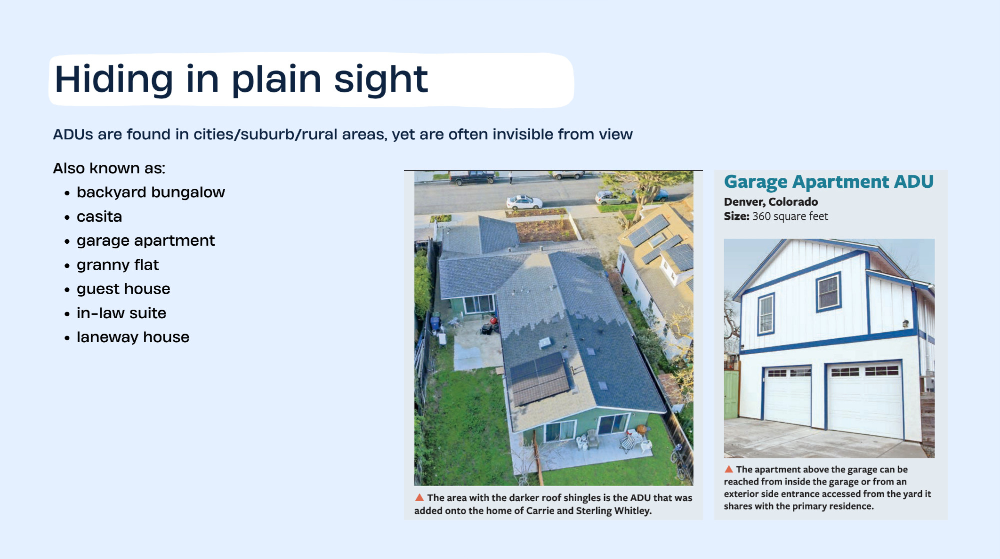
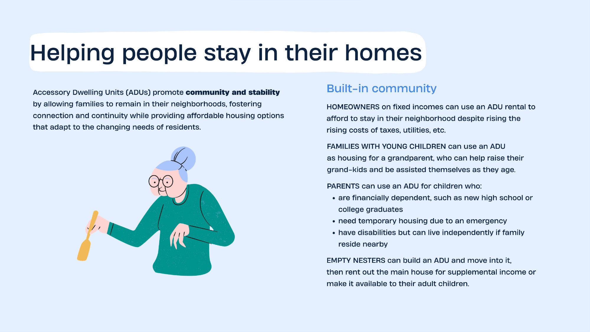
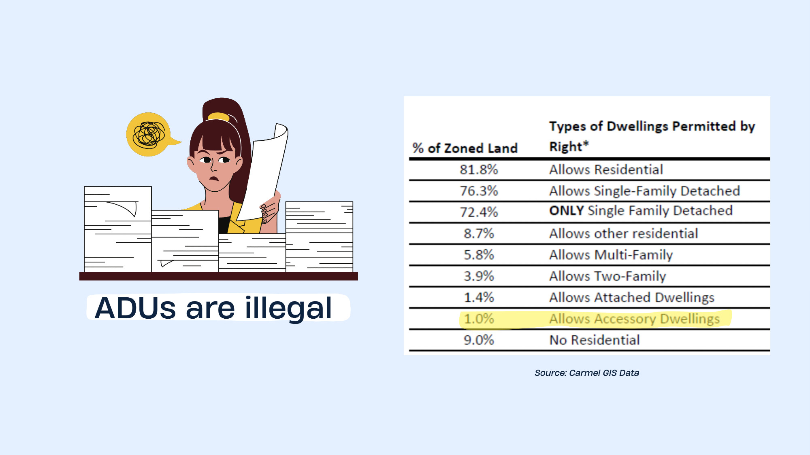
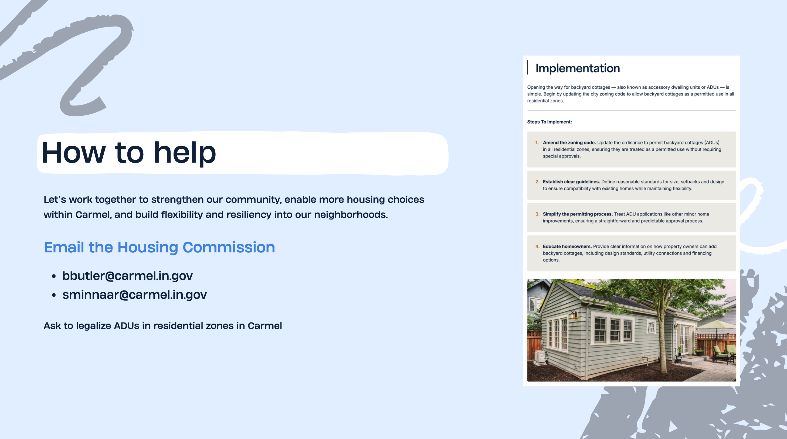

If you’ve lived in Carmel for any length of time, you’ve probably noticed something subtle but important: it’s getting harder for people to find an affordable place to live. Not just anyone, but the people we care about most. Our children and grandchildren. The teacher down the street. The firefighter who shows up when something goes wrong. The neighbor who raised a family here and now wants to stay, even as life changes.

Carmel is a place people love and they don't want it to change. But change is happening, regardless. Rising housing costs have made it difficult, if not impossible for many families to afford living in Carmel. How many people do you know who say they couldn't afford to buy the home they live in now? Many people who grew up in Carmel, can't afford to return home and end up moving to northern Indy, Westfield, etc. Maybe you'd like to get out of your large home, but there's nothing affordable in walkable neighborhoods?

While there are larger economic forces at play, we've also made the problem worse by restricting what owners can build on their own property. We’ve made it increasingly difficult for people to remain part of this community at different stages of life.

<figure class="figure">
  
</figure>

## A city of big dreams but few housing options

Over time, Carmel has become a city dominated by large single-family homes. Today, about half of our housing stock has four or more bedrooms, even though the average household is much smaller. That mismatch means a young couple just starting out has very few entry points into the community. It means a single person or a small family is often forced to rent at high prices or look elsewhere entirely. And it means empty nesters are left with a difficult choice: stay in a home that no longer fits their needs, or leave the neighborhood they love.

At the same time, housing costs have risen much faster than wages. This isn’t theoretical. It shows up in everyday conversations:
- “My kids can’t afford to live here.”
- “We’d like to downsize, but there’s nowhere to go.”
- “There just aren’t many options.”

And increasingly, the data backs that up. We now have clearer evidence of what many residents already feel: Carmel needs more housing choices. Nearly 90% of residents say there is a lack of affordable housing for young adults and seniors. And 86% say diverse housing options are important. This is no longer a niche issue. It’s a widely shared concern.

<figure class="figure">
  
</figure>

## What's missing in Carmel: more house-scale choices

When we talk about housing, the reality in Carmel is that we mostly have two options on either end of the spectrum: large suburban homes or tightly-packed apartments. What's missing, because it is illegal or impractical to build due to our zoning code, is more house-scale options.

<figure class="figure">
  
  <figcaption class="figure-caption text-center">Missing Middle is house-scale buildings (gentle density)</figcaption>
</figure>

While the city is focused on building mid-rise luxury condos and apartments in Midtown, we're missing out on a range of options for more gentle density citywide. These "missing middle" developments are small, flexible housing options that fit naturally into neighborhoods: duplexes, cottage homes, and yes, ADUs. Today, most of these options are effectively illegal to build in Carmel.

## What exactly is an ADU?

An ADU is a small, self-contained home on the same property as a single-family house. It might be a backyard cottage, an apartment over a garage, or a finished basement with its own entrance. You’ve probably seen them before. They’re not new or radical, but in most of Carmel today, they’re not allowed to be built without going through a complex approval process designed for much larger projects.

<figure class="figure">
  
</figure>

ADUs are another missing middle type of housing:
- For **young families or individuals** — an ADU can serve as an affordable first home or rental option in a desirable neighborhood. Because ADUs are often smaller and more cost-efficient to build, they tend to be more affordable than new single-family houses.
- For **seniors or retirees**, ADUs make “aging in place” possible: they can move to a smaller, manageable unit (with potentially universal design or accessible features) and possibly rent out their main house, or keep family close while preserving independence.

In this way, ADUs provide housing for a range of life stages and help Carmel remain demographically diverse and inclusive. Perhaps the most important reason to allow ADUs is this: they help keep Carmel a place where people can stay. Stay when they’re starting out. Stay when their family grows. Stay when they want to downsize. Stay when they retire.

<figure class="figure">
  
</figure>

Backyard cottages can support multi-generational living. They create naturally more attainable housing options. And they strengthen neighborhoods by allowing families to remain connected. Legalizing gentle density like ADUs can help make sure that Carmel remains a special place for the next generations.

If this topic feels familiar, it’s because Carmel has been here before. In 2021, [the city debated](https://www.youarecurrent.com/2021/02/02/after-revisions-to-proposal-carmel-councilors-question-need-to-change-approval-process-for-accessory-dwellings/) relaxing restrictions on Accessory Dwelling Units (ADUs) to help produce more housing. The result was a compromise that left most of the status quo in place: a full Board of Zoning Appeals (BZA) approval for any detached dwellings.

<figure class="figure">
  
</figure>

A lot has changed since then:
- A new mayor convened a [Housing Task Force](https://www.carmel.in.gov/589/Housing-Task-Force) to study local housing needs
- That task force recommended revisiting ADUs as part of a broader strategy
- A [2024 housing survey](https://www.carmel.in.gov/DocumentCenter/View/980/Carmel-Mayors-Housing-Task-Force-Findings-and-Recommendation-Report-PDF?bidId=) found overwhelming support for more housing options
- Indiana recently passed [HB1001](https://iga.in.gov/legislative/2026/bills/house/1001/details), which requires a public review of the city zoning code

But people still have the same concerns as in 2021.

##### Will ADUs change the character of my neighborhood?

This is the most common concern. But ADUs are not large developments. They are small additions, often invisible from the street. Carmel already has clear [standards for Accessory Buildings](https://codehub.gridics.com/us/in/carmel#/10ce4905-206a-4e1b-ad24-78aa0fcc9944/bdb0adcc-3074-4dc2-98c6-c6a2651537d5), which if nothing changed, would ensure:
- Units remain small and subordinate to the main home
- Setbacks and design protect privacy
- Placement minimizes impacts on neighbors

The goal isn’t to change neighborhoods overnight. It’s to allow them to adapt slowly over time. Even if every residential property were allowed to build an ADU today, they wouldn't pop-up everywhere overnight. Building an ADU still requires significant financial investment, planning, coordination, and other hurdles.

##### What about traffic, parking, and infrastructure?

Concerns about congestion and infrastructure are understandable. But ADUs are added one at a time, across many neighborhoods — not all at once in a single location. They typically house one or two people, not large households. That means fewer trips, fewer cars, and minimal impact. And importantly: they use infrastructure we’ve already built. The bigger financial risk for a city isn’t adding one more household, it’s maintaining miles of infrastructure without enough people to support it. Plus, the existing code already requires reserving space for parking for each dwelling unit added to a property.

##### Will this hurt property values or neighborhood stability?

This concern often comes down to fear of the unknown (or fear of absentee landlords). But ADUs are most often built and managed by homeowners who live on-site. That creates a very different dynamic than large-scale rental development. If this is a concern, Carmel can address it directly by:
- Requiring owner occupancy
- Limiting the number of units per lot

Done well, ADUs tend to increase flexibility and value, not reduce it.

> Instead of apartment buildings, or giant single-family homes, there’s a third, more transformative idea: Hyperlocal Development. This concept posits that the most stable, equitable, and sustainable form of urban regeneration is driven by the people who currently live in the community. It encourages resident-developers. By empowering existing Single-Family Housing (SFH) lot owners to act as micro-developers (specifically by splitting their lots to create a second buildable parcel or by adding significant density through accessory units) the city can simultaneously address its housing crisis and create a robust engine for generational wealth building.
> 
> [Double Up the Lot: Turning Backyards into Bank Accounts](https://www.thinkingbigbythinkingsmall.com/p/double-up-the-lot-turning-backyards) by Urban Planner Jeffery Tompkins

##### Will these become Airbnbs instead of homes?

This is a policy choice. Allowing ADUs does not mean allowing short-term rentals. If Carmel wants ADUs to support long-term residents, it can apply the existing regulations around short-term rentals to ADUs as well.

> A survey of ADU owners in three
Pacific Northwest cities with
mature ADU and short-term rental
markets found that 60 percent of
ADUs are used for long-term
housing as compared with 12
percent for short-term rentals.
>
> Respondents shared that they
“greatly value the ability to use an
ADU flexibly.” For instance, an
ADU can be rented nightly to
tourists, then someday rented to a
long-term tenant, then used to
house an aging parent. ADUs
intended primarily for visting
family are sometimes used as
short-term rentals between visits.
>
> Cities concerned about short-term
rentals can regulate them across
all housing types. Doing so might
mean that special rules are not
needed. An approach employed in
Portland, Oregon, is to treat ADUs
the same as other residences
except that any financial incentives
(such as fee waivers) to create
them are available only if the
property owner agrees not to use
the ADU as a short-term rental for
at least 10 years.
> 
> [AARP: The ABCs of ADUs](https://www.aarp.org/content/dam/aarp/livable-communities/housing/2022/ABCs%20of%20ADUs-web-spreads-082222.pdf)

##### Are we losing our voice if this is allowed “by right”?

The existing system requires case-by-case approvals through the [Board of Zoning Appeals](https://www.carmel.in.gov/government/boards-commissions-committees/board-of-zoning-appeals) (a process designed for large, complex developments). But applying that same process to small backyard units creates friction that discourages everyday homeowners from participating. Allowing ADUs “by right” doesn’t remove local control. It shifts it earlier in the process, where the community sets clear rules upfront.
- Everyone knows what is allowed
- Everyone is held to the same standards
- Fewer conflicts between neighbors

It’s a more predictable, transparent system. Plus, many neighborhoods within Carmel also exist within an HOA, which has it's own restrictions on ADUs. So even if the city were to legalize them entirely in all residential zones, they would still be limited by what each HOA allows.

> Well-intentioned but burdensome rules can stymie
the creation of ADUs. ADU-related zoning codes
should be restrictive enough to prevent undesirable
development but flexible enough that ADUs get buil
> 
> [AARP: The ABCs of ADUs](https://www.aarp.org/content/dam/aarp/livable-communities/housing/2022/ABCs%20of%20ADUs-web-spreads-082222.pdf)

##### Is this even a meaningful solution?

Some critics argue that ADUs are too small to matter. And they’re right, if you’re expecting a single policy to solve everything at once. But that’s not how strong towns grow. ADUs are not a silver bullet. They are a starting point. They are one tool, among many, that allow housing to evolve gradually, in response to real needs.

At Strong Towns, we talk about the difference between large, top-down development and small, incremental growth. ADUs are the definition of a small bet. They’re built one at a time, by homeowners, not large developers. They don’t require massive infrastructure expansions. They don’t dramatically change the look or feel of a neighborhood. Instead, they quietly add one more home. One more neighbor. One more opportunity. Over time, those small additions add up.

## What are the next steps?

Carmel has already done the hard part: studying the issue, gathering data, and [hearing from residents](https://www.youarecurrent.com/2026/03/06/column-housing-roundtables-inspire-lively-respectful-debate/). Now there’s an opportunity to act.

Legalizing ADUs by right, with clear and reasonable standards, is a small step towards giving residents what tehy are asking for: more housing options. Not a sweeping overhaul. Not a radical shift. Just a simple change that allows the city to grow in a more flexible, resilient way. If Carmel moves to legalize ADUs, here’s how to do it in a way that stays true to Strong Towns values:

- **Allow ADUs by right** (rather than requiring special permits or conditional use) in single-family zones to reduce barriers and encourage modest, incremental additions.
- **Permit a variety of ADU types** — detached cottages, garage-apartments, basement conversions, internal “in-law” units all maximize flexibility and allow homeowners to adapt to their property.
- **Set reasonable size, parking, and design standards** — enough to preserve neighborhood character, but not so burdensome that building an ADU becomes impractical.
- **Provide homeowner guidance and pre-approved plan sets** — simple, clear plans and building guidelines to lower the cost and complexity of building ADUs, to encourage responsible small-scale growth.
- **Encourage affordability and intergenerational use** — by offering incentives (e.g., streamlined permitting, modest tax incentives or waivers) or programs for seniors, young families, or small households to build ADUs, or to rent to lower-income tenants.

There are plenty of excellent resources available to help guide our city through this process, like [this guide from the AARP](https://www.aarp.org/pri/topics/livable-communities/housing/expanding-adu-development-solutions-local-barriers/) and this [housing-ready toolkit from Strong Towns](https://static1.squarespace.com/static/53dd6676e4b0fedfbc26ea91/t/67b744f40b30173eed3dfca0/1740064010957/The+Housing-Ready+City.pdf?apcid=0066d9ef0f88be44d3817503&utm_campaign=deliver-housing-ready-city&utm_content=deliver-housing-ready-city&utm_medium=email&utm_source=ortto).

If we want Carmel to remain strong financially, socially, and culturally, we need to make room for the next generation and support the people who are already here. ADUs won’t solve everything. But they are a proven, locally controlled way to start. They represent the kind of change that builds strong towns: small in scale, responsive to real needs, and led by the people who call this place home. And they help answer a question more and more families are asking: Will our kids be able to live here? With the right small changes, the answer can still be yes.

If you'd like to see more missing middle housing in Carmel, you can voice your support for legalizing Accessory Dwelling Units by:
- emailing the Housing Commission: Bric Butler [bbutler@carmel.in.gov](mailto:bbutler@carmel.in.gov)
- emailing Shannon Minnaar, the city council representative on the Housing Commission: [sminnaar@carmel.in.gov](sminnaar@carmel.in.gov)
- [speaking at city council meetings or contacting your city councilor](https://www.carmel.in.gov/government/city-council/how-to-be-heard)

<figure class="figure">
  
</figure>
