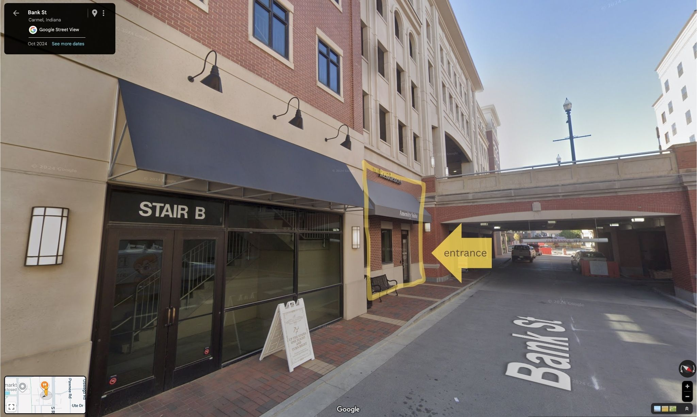

- What: Housing - ADU legalization ([agenda](https://docs.google.com/document/d/1-r7o1UkXyYDUQO-ufOSzDo0j9ADlG01_gyilLd2al44/edit?usp=sharing))
- When: Saturday September 27th, 11am - 12pm
- Where: 100 Bank St, Carmel, IN 46032 (next to the [fitness center](https://maps.app.goo.gl/heC9Jy5eJVg9xkRV9), at the bottom of Veterans Garage)

<figure class="figure">
  
  <figcaption class="figure-caption text-center">Entrance to City Center Amenity Street below Veterans Garage</figcaption>
</figure>

Join us for our monthly meeting to discuss local development, infrastructure, and community resilience. We'll start with a presentation by HAND on affordable housing in Carmel. We'll also talk about ADU legalization.

  <a href="https://docs.google.com/forms/d/e/1FAIpQLSdOBMxhdt4-Jh31UY4tQJqYEt7o28VXwQ0Dp8UwssDe9HDx9A/viewform?usp=header" class="btn btn-lg btn-primary">RSVP</a>

Copy to [Google Calendar](https://calendar.google.com/calendar/event?action=TEMPLATE&tmeid=cjk5cjF2YnVscW45N2VjOTRuOTZxMGJzM3NfMjAyNTA5MjdUMTUwMDAwWiA2Y2E0MzNkNmRmZTAwNWZjYWRhMjNhODVkMGYxYzg4MjJiMmFjNzdmZjg5MDgxMjUwNWZmNjcxZTRmODU4MmNmQGc&tmsrc=6ca433d6dfe005fcada23a85d0f1c8822b2ac77ff890812505ff671e4f8582cf%40group.calendar.google.com)