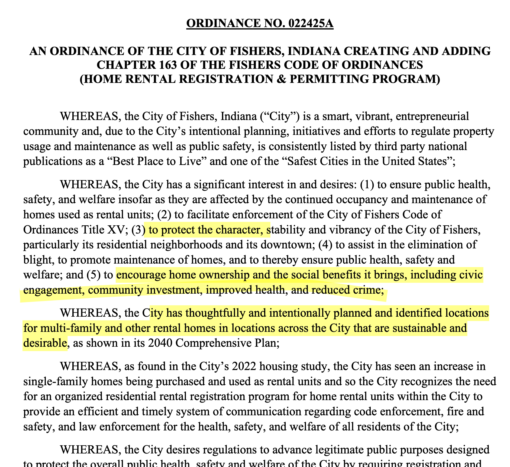

_This was originally published on [simpixelated.com](https://simpixelated.com). It has been reposted here with permission from the author._

Fishers, a nearby city in Indiana, is considering a [ban on new rental properties](https://fishersin.gov/government/administrative/rental-registration-permitting-program/) beyond 10% in each subdivision. According to one of my city’s [council-members](https://www.carmel.in.gov/government/city-council/jeff-worrell), residents in Carmel are also asking for a similar policy. Frankly I'm disturbed at this idea and I emailed them to say as much. If the goal of such a policy is to alleviate our housing affordability crisis, then it will be ineffective at best and counterproductive and discriminatory at worst. Artificially limiting rental housing supply will only put upward pressure on rents, as it does nothing to reduce demand.

## What is the intent of the proposal?

This ordinance is framed as a response to the housing affordability crisis which is exacerbated by corporate investors buying up houses to turn into rentals. A [recent report](https://www.fhcci.org/wp-content/uploads/2025/01/FHCCI-SFR-Investor-Update-1-9-25.pdf) by the Fair Housing Center of Central Indiana (FHCCI) claims that “Investors own between 4-7% of all single-family homes” in Marion and the four surrounding counties: Hamilton, Hancock, Hendricks, and Johnson. That may not seem like much, but with only 10% of Hamilton County homes for rent, nearly half of those are investor-owned.

I’m sympathetic to the idea of limiting corporate greed and I wouldn’t shed a tear for the investors that might be turned away by this policy. Unfortunately, there’s nothing in this ordinance that targets corporations specifically. What's proposed is a broad ban on rentals above an arbitrary threshold (which we’ve already reached in Hamilton County), regardless of whether it’s a local resident owner or a corporate out-of-state investor.

I recognize there are limits to what city councils can do and a law specifically targeting corporations might require legislation at the state or federal level. If that’s true, then republican city council members and other representatives in Hamilton County should be pushing their colleagues to create and support that kind of legislation. There have been multiple bills aimed at limiting corporate investment in single-family homes in [Ohio](https://www.legislature.ohio.gov/legislation/legislation-summary?id=GA134-SB-334), [California](https://legiscan.com/CA/text/AB2584/2023), [Nebraska](https://finance-commerce.com/2024/02/first-in-nation-bill-seeks-to-ban-corporations-from-buying-single-family-homes/), [Minnesota](https://patch.com/minnesota/saintpaul/mn-bill-bans-corporations-buying-homes-rent-out), and at the [federal](https://www.nytimes.com/2023/12/06/realestate/wall-street-housing-market.html) level.

The difference with those proposals is they protect tenants and individual owners while targeting corporate investors. For example, the [Ohio bill](https://www.route-fifty.com/infrastructure/2022/07/while-investors-are-snatching-homes-governments-fight-save-properties-residents/368927/) would: “impose a 45-day waiting period once a private investment firm offers the highest bid on a rental property in foreclosure. During that time, the tenants, if they can match the bid and agree to live in the home for one year, may buy the property. Also during that window, another buyer—an individual who promises to live there for a year and offers more than the winning bid, or a nonprofit af fordable housing group—may buy it.” Legislation like this prevents turning would-be renters into collateral damage.

### Protecting property values and neighborhood “character”

While it’s being claimed the intent of this ordinance is to limit corporate investment, I think there are ulterior motives, which were highlighted in a recent [IndyStar article](https://www.indystar.com/story/news/local/hamilton-county/fishers/2025/02/25/indiana-city-fights-wall-street-landlords-new-law-rentals-tenants-renting-fishers-housing/80259722007/):

> Many homeowners worry investors are concerned only with collecting rent and not with maintaining homes' quality, dragging down property values across the neighborhood […] (Investors') properties are not well-maintained. The HOA cannot get a hold of anybody. There are more rules violations. The owners are not involved in the community.

The key phrase here is “dragging down property values”. While I’m certain that investors do not want to be “involved in the community” and plan to do the minimum maintenance, at best, we should remember that ultimately it’s just people living in these homes, not corporations. Our local government should be more concerned about protecting tenants than property values. The actual wording of the ordinance makes this intent explicit:

I don’t have to read between the lines to understand that this ordinance proposes to:

- “protect the character” of the city
- “encourage ownership and the social benefits it brings”
- keep renters in “planned and identified locations”

Apparently the Fishers city council believes that renters are disengaged in civics, uninvested in the community, unhealthy, and more likely to be criminals. At this point, I shouldn’t be surprised that a suburban community in central Indiana is working on further solidifying home ownership as the only means of participating in society. This is a policy that extends HOAs abilities to limit the types of people that can live in their community and makes those restrictions enforceable by city law.

At a recent [town-hall discussion](https://www.youarecurrent.com/2025/03/11/two-rental-cap-meetings-two-different-viewpoints/), Norma Johnson, a senior citizen, spoke to some of the discriminatory rhetoric being used:

> “I hear people say they don’t want Fishers to end up like Lawrence. And of course, we know the diversity of Lawrence,” she said. “To me, that’s a way of saying we don’t want ‘those people’ coming in to our community from Indianapolis. I know that’s what they’re thinking when they say something like that. I’m old enough to remember restrictive covenants that they had where Black folks and Jews couldn’t buy homes in certain areas. So, this is just another way of eliminating certain people in their community.”

## How can Hamilton County cities solve the root problem?

I think investors buying up single family homes is merely a symptom of a larger problem: not enough homes for the amount of people who want to live here. Over [7,000 people moved to Hamilton county in 2024](https://www.indystar.com/story/news/local/hamilton-county/2025/03/14/indiana-population-gains-2024-fastest-growing-communities-hamilton-county-carmel/82363148007/) alone, which continues a trend of growth as people move from more expensive parts of the country to central Indiana. Meanwhile, less than 5,000 new homes have been built _this decade_ according to the [Indiana Housing Dashboard](https://indianahousingdashboard.com).

A task force within Carmel City Hall spent half of last year determining that: “Carmel and the region does not have enough of the smaller ownership units that are desired by both seniors looking to downsize and young, first-time home buyers.” It's safe to assume that Fishers is in the same situation, but this ordinance does nothing to address the gap in supply. In fact, it will reduce the already abysmally low supply of rental housing; just 10,000 homes in Hamilton County for a population 330,000 plus.

While cities may be limited in their power to target corporations, they do wield a huge amount of power over housing supply. If you’re familiar at all with Strong Towns, you know their recommendation for [incremental housing](https://www.strongtowns.org/housing). In Carmel, Fishers, and all over the country, it is illegal to build a duplex, attached townhomes, or even ADUs in most neighborhoods. This next level of gentle density, called the “missing middle”, is exactly what [Carmel’s Housing Task Force recommends](https://www.carmel.in.gov/home/showpublisheddocument/22569/638676318201300000) building more of.

In order to allow that to happen, the city should be looking at relaxing zoning codes and making it easier for small developers to build in existing neighborhoods. I’ve talked about [the options](https://simpixelated.com/how-to-build-missing-middle-in-carmel/) before, but I’ll reiterate them here:

- reduce [parking mandates](https://parkingreform.org/what-is-parking-reform/)
- reduce [minimum lot sizes](https://www.mercatus.org/research/policy-briefs/urban-minimum-lot-sizes-their-background-effects-and-avenues-reform)
- allow [duplexes and triplexes](https://www.strongtowns.org/journal/2018/12/12/three-cheers-for-minneapolis-the-3-is-for-triplex) in single family zoning
- legalize granny-flats or [Accessory Dwelling Units](https://www.strongtowns.org/journal/2019/8/21/three-cheers-for-lexingtons-adu-ordinance) (ADUs)

These are proven policies for increasing the supply and affordability of housing, being enacted in places like South Bend, Minneapolis, Lexington, Austin, and others.

Putting a cap on rentals will work against increasing housing supply. What incentive is there for homeowners to build a granny-flat in their backyard, if they cannot rent it? What incentive will there be for a small developer to build a duplex or triplex in a neighborhood where the cap has been reached? It’s already extremely financially risky, if not impossible, to finance small incremental development projects in places like Fishers and Carmel. The return on investment for multi-family only works out at the scale of subdivisions and large apartment complexes — and even then only with subsidies like [TIF](https://www.choosecarmelin.com/tax-increment-finance).

This rental cap is likely to kill any future chances of incremental development happening in Fishers. It will further entrench two types of housing as the only ones available:

1. single family homes for purchase (if you can afford it)
2. investor-owned apartments for everyone else

I can’t do anything about Fishers, but I definitely plan to fight against this policy if it is proposed in Carmel. As a current renter with a kid and a dog, I appreciate that there are at least some houses available to rent. I want that to remain an affordable option. If I do become a homeowner someday, I want the flexibility of being able to rent out my home if I move away temporarily or want to save the home for my children. I don’t want to be forced to sell the house because too many of my neighbors beat me to renting their house first.

Have thoughts? [Continue the conversation on Reddit](https://www.reddit.com/r/Carmel/comments/1jfo33d/should_carmel_cap_singlefamily_rentals_fishers_is/).
