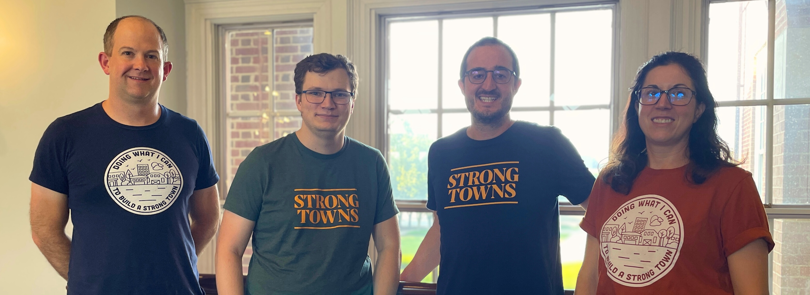

We participated in an official city hall meeting for the first time as a group at the Climate Action Advisory Committee, which is an advisory committee to the mayor for helping achieve Carmel’s [Climate Action Plan](https://climatecarmel.com/) goals.

<figure class="figure">
  
  <figcaption class="figure-caption">Strong Towns Carmel members at city hall</figcaption>
</figure>

While Strong Towns does not have a specific goal of fighting climate change, the founder of Strong Towns believes that a [bottom-up revolution](https://www.strongtowns.org/journal/2022/7/13/for-those-who-wish-wed-talk-about-climate-change-more) is going to be more successful than top-town legislation. A majority of Strong Towns' campaigns combat climate change by lowering dependency on cars, reducing asphalt covered heat-islands, planting more carbon storing street trees, and re-using and adapting existing infrastructure.

Strong Towns Carmel is focused on making Carmel an even safer and more joyous place to walk, bike, and (hopefully someday soon) ride public transit. Better options for replacing car trips will make Carmel stronger and more sustainable, while also lowering greenhoue-gas (GHG) emissions -- a specific goal of the Climate Action Plan.

At the meeting I spoke to our advocacy for three things in Carmel: safer routes for walking and biking, funding public transportation, and legalizing missing middle housing. You can listen to my public comment about 3 minutes into this video:

<iframe width="560" height="315" src="https://www.youtube-nocookie.com/embed/_MOxjvd7rVE?si=NXjs6I_iU0ma75lt" title="YouTube video player" frameborder="0" allow="accelerometer; autoplay; clipboard-write; encrypted-media; gyroscope; picture-in-picture; web-share" referrerpolicy="strict-origin-when-cross-origin" allowfullscreen class="mb-2"></iframe>

Here’s the transcript of my public comment:

> My name is Jordan Kohl. I’m a resident of Carmel. Thank you to the committee for allowing me to give public comment today. I’m representing a group of residents who have formed Strong Towns Carmel, which is part of a national non-profit that advocates for changing the suburban development pattern to one that is financially strong, resilient, safe, and livable.
> 
> Locally, our group is excited about the future of Carmel and the potential to make places like Midtown and Carter Green accessible to more people without adding traffic. While not specifically focused on climate, the types of projects we’re advocating for align well with this committee’s goals and Carmel’s Climate Action Plan. Three campaigns I’d like to share with you today are: safe routes for walking and biking, public transportation, and missing middle housing.
> 
> In Carmel as of 2018, transportation accounted for 40% of total GHG emissions. Reducing our dependency on cars is critical to enhancing air quality, improving human health, and meeting our goal of net zero GHG emissions by 2050.
> 
> To do that, we have to give people alternatives to driving that are safe, efficient, and low-stress. In the United States, half of all trips are [less than 3 miles](https://www.energy.gov/eere/vehicles/articles/fotw-1230-march-21-2022-more-half-all-daily-trips-were-less-three-miles-2021) and a third are less than a mile — pretty short for a walk and almost nothing on an e-bike. However most people still drive because its simply easier: they can drive straight there without worrying about picking the “safest” route and there is guaranteed to be parking when they get there, often right out front.
> 
> Trails like the Monon are safe and efficient because they are mostly separated from vehicle traffic. They are low-stress for people of all ages. Because they connect with destinations like Midtown and Central Park, people are able to use these not just for exercise, but as transportation corridors.
> 
> Myself and many members of our group use these every day to get to school, groceries, and restaurants. Compared to roads and parking garages, these are relatively small investments that are already helping reduce GHG emissions. That’s why we’re so excited to support the [Autumn Greenway](https://strongtownscarmel.org/blog/the-autumn-greenway/): a proposed off-street trail that will connect thousands of residents with Old Meridian, Midtown, and the rest of our path network.
> 
> We can get even more emission reductions by layering in public transportation to extend how far people can travel without a car. The city revealed that investment in public transportation is supported by 84% of [survey respondents](https://youarecurrent.com/2025/07/03/transportation-survey-confirms-interest-in-expanding-public-transportation-in-carmel/). We’re here to show the faces of some of those respondents!
> 
> Lastly, Strong Towns Carmel supports building more housing where people can walk, bike, or ride a bus to our wonderful amenities. This can be accomplished with small changes to our zoning code. The Housing Task Force has already identified a need for [missing middle housing](https://strongtownscarmel.org/blog/how-to-build-missing-middle-in-carmel/).
> 
> We support legalizing backyard cottages, duplexes, and starter homes on smaller lots. As opposed to whole apartment blocks, this kind of development is stable, gentle density that doesn’t ruin neighborhood character. Instead, it provides more options near downtown for first time home buyers and older generations looking to downsize.
> 
> We think these three projects: improving our path network, adding public transit, and legalizing more housing choices, will have the most impact on achieving Carmel’s climate goals. I look forward to working together on these and other ways to improve Carmel. I welcome everyone to join our monthly meetings. You can learn more at strongtownscarmel.org. Thank you for your time today.

If you are interested in helping build a better Carmel and advocating for safe and productive streets, public transportation, and more housing choices, please [join us](https://strongtownscarmel.org/join/)!