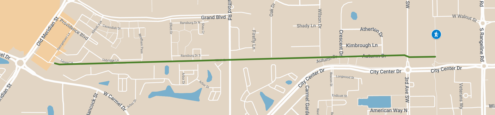
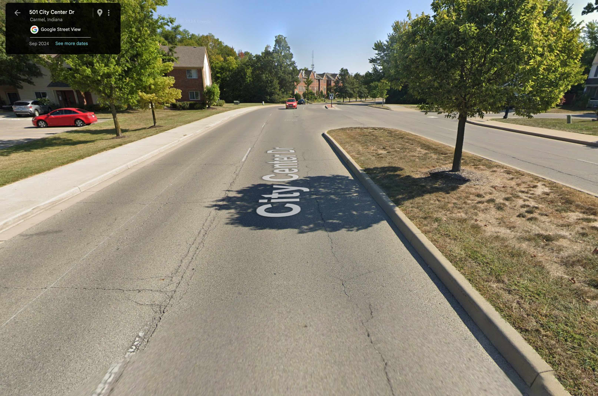
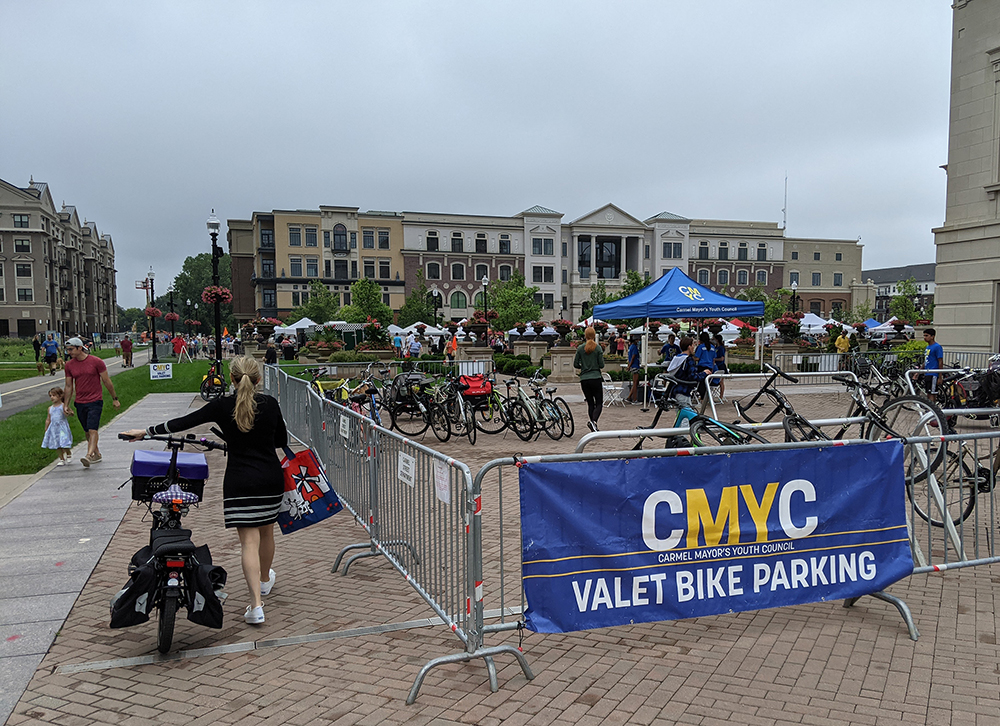

The vison for this off-street path is to connect the urban cores of Carmel. It would add a roughly one mile extension to the Monon Trail, starting from Autumn Drive, connecting to 126th Street, and eventually ending at Old Meridian Street. It would provide a pleasant and safe connection to the farmer’s market, restaurants, groceries, and more, for thousands of residents who currently live just out of walking distance of the Monon Trail.

<figure class="figure">
  
  <figcaption class="figure-caption">Proposed route</figcaption>
</figure>

##### Why We Need This

- there are no east-west off-street paths of the level of the Monon Trail
- providing a direct route, separated from vehicle traffic, enables people of all ages to travel through central Carmel comfortably
- alternative transportation reduces traffic, wear and tear on our roads, and the amount of parking we need
- adds safe routes to central Carmel schools (which are notorious for creating traffic)
- history proves that it will raise property values for everything along the trail route
- adds another park-like amenity, building value and attraction to residents, businesses, and tourists

The Autumn Greenway represents more than just another path—it’s a vital east-west connection that matches the high standard set by the Monon Trail, which has transformed how we live, commute, and connect with local businesses. Many of us rely on the Monon daily to replace car trips, promote healthy living, and support Carmel’s vibrant restaurant and retail economy. The Monon’s key to success is clear: it is fully separated from vehicular traffic, ensuring safety for children, families, and cyclists of all ages.

▶️ Watch [Riley's video](https://www.youtube.com/watch?v=nmqCMsSQ76Y) for a detailed breakdown

#### Connecting Neighborhoods

This transformational project would benefit the entire city, but more specifically it would connect and uplift the multi-family neighborhoods south of Grand Boulevard by providing safe and equitable access to the larger trail network. The Monon Trail is the centerpiece of Carmel, Indiana. It connects the city with Indianapolis to the south and Westfield to the north. On holidays, weekends, and warm weather months, people from all over use the trail for exercise, recreation, and to visit local businesses on Main Street, Midtown, City Center, and more.

> “The city’s Arts and Design District is centered around the Monon. Upscale Midtown, with nearly a billion dollars in development investment, rose because of it.” - [from IndyStar](https://www.indystar.com/story/news/local/2021/07/28/the-monon-trail-indianapolis-once-controversial-now-beloved/5324106001/)

For thousands of residents, getting to the Monon without a car is inconventient and stresssful enough to prevent most from doing it. Between the rapidly redeveloping core Old Meridian and well-established Midtown, there is no direct path for pedestrians or bicyclists.

<figure class="figure">
  
  <figcaption class="figure-caption">City Center Drive is a thoroughfare</figcaption>
</figure>

A pedestrian going from Midtown to Old Meridian has to walk a half-mile out of their way, on narrow sidewalks alongside winding four-lane roads, across double lane roundabouts and watching for cars at every driveway. Along City Center Drive, there is no separation from cars traveling 40 MPH and very little shade. It is not a convenient route for bicyclists and no parent would feel safe letting their child walk it alone. It’s inconvenient, stressful, and dangerous for anyone outside of a car. So despite being just a mile apart, most people choose to drive when traveling between these neighborhoods.

#### Reducing Traffic

To help ease traffic congestion as the city continues to grow, we need more transportation options. The amount of bikes parked at the farmer’s market on any given summer weekend proves that people are willing to bike or walk when there is a safe and convenient way to do so.

<figure class="figure">
  
  <figcaption class="figure-caption">The bike valet at Carmel Farmer’s Market is always in use</figcaption>
</figure>

The Monon Trail is amazing for traveling north and south, but we need more connections going east and west. We need more safe biking and walking infrastructure to encourage people to leave their car at home.

Everyone will benefit from fewer cars on the road, even those that never use this proposed path. For those that still choose to drive, they will encounter less traffic on the way and more parking spaces at their destination.

#### Providing Safe Routes to School

Carmel Elementary, Carmel Middle, and Carmel High School are all within walking distance of the Monon Trail, but getting across town can be difficult and dangerous on foot or by bike. The Autumn Greenway will give students traveling east or west a safe option for a large portion of the trip.

For example, elementary age students living along Old Meridian could take the path, separated from cars, to the Monon Trail, and then across Rangeline around Midtown. High school students could do the same, taking the greenway to the Monon and then on to Main St. with minimal interactions with cars. Finally, students attending Carmel Middle School would have another option for getting to Guilford Road.

#### Benefitting Our Local Economy

It has been proven that multi-use paths like the Monon have a dramatically positive economic impact on the areas they connect. In fact, a [recent study](https://southernindianabusinessreport.com/2023/05/31/monon-south-brings-economic-health-benefits/) by Indiana University School of Public Health concluded "the net economic impact of trails and active transportation annually in Indiana is as much as $1.6 billion". Those benefits "increase exponentially as the connectivity between trails, people and places improves".

The Monon Trail has already stimulated more than a billion dollars in development investment in Carmel and [raised property values by at least 11%](https://www.indystar.com/story/news/local/2021/07/28/the-monon-trail-indianapolis-once-controversial-now-beloved/5324106001/) in Indianapolis. Properties along the Monon in Carmel are the "the [most sought-after properties](https://carmelmonthlymagazine.com/celebrating-two-decades-of-the-monon-greenway/)", making the trail the equivalent of ["beach-front property in Central Indiana"](https://carmelmonthlymagazine.com/celebrating-two-decades-of-the-monon-greenway/).

The Autumn Greenway will also likely improve property value for property owners along the new trail. It will increase the chance that people walking and biking will stop at a local business. It will provide another reason for tourists to visit Carmel. It will increase the likelihood that employees will want to relocate and stay in the area.

There are other indirect benefits of The Autumn Greenway for the local economy: the more people who choose to walk or bike instead of driving, will reduce the overall wear and tear on our roads. With fewer people on the road, the less chance of an accident, which is a drain on our emergency response and hospital systems. People wanting to enjoy a beer or two at Sun King will have another option to walk home safely, preventing possible drunk driving accidents.

#### Providing Shared Green-space

In addition to providing a path for active transportation, this extension would also provide a safe and calming place for people to walk their dog, exercise, and enjoy green-space. The cross-country teams at Carmel Clay Schools already use The Monon Trail for training as ["an alternative to busy streets and narrow sidewalks"](https://carmelmonthlymagazine.com/celebrating-two-decades-of-the-monon-greenway/). The Autumn Greenway will provide another (much needed) linear park within central Carmel.

#### Achieving Climate Goals

Carmel’s Climate Action Plan outlines strategies for achieving net zero GHG emissions by 2050, including:

- [Encourage Multi-Modal Transportation and Walkability](https://climatecarmel.com/actions/T-1)
- [Expand Promotion of Bicycles as Alternative Mode of Transportation](https://climatecarmel.com/actions/T-6)
- [Promote Local Food Purchasing](https://climatecarmel.com/actions/FA-3)
- [Evaluate Farmers Market Potential for Accessibility](https://climatecarmel.com/actions/FA-7)

All of these could be addressed or improved by an extension to the Monon Trail. Because of it’s location (ending just north of City Center Drive), it will add low-stress access to the farmer’s market for many residents, which will encourage people to buy more local food, use multi-modal transportation, and make it easier to adopt bicycles as an alternative to driving.

### Design and Development Timeline

I’m happy to announce that in part due to our advocacy, the project has been funded and scheduled for development, hopefully as early as 2026! From the [Current in Carmel](https://youarecurrent.com/2024/12/30/full-steam-ahead-mayor-plans-to-continue-robust-pace-of-progress-in-2025/):

> CCPR also expects to continue plans to expand its trail network. It is working with the city to create the Autumn Greenway, which will stretch east-west from Midtown/City Center to the Old Meridian Street corridor; and a north-south greenway connecting Autumn Greenway to Main Street. Land acquisition and planning is expected to occur in 2025, with development set to begin in 2026, according to CCPR Director Michael Klitzing.

- 2022 - Riley created an [amazing video](https://youtu.be/nmqCMsSQ76Y) highlighting the problems that the Autumn Greenway could solve.
- 2023 - A small group of local bicycle advocates started meeting monthly, calling ourselves the The Carmel Transportation Party. Based on Riley’s video, the off-street trail (with the working title “Monon Extension”) was one of our main topics.
- Jan. 2024 - Newly elected city council member [Matt Snyder](https://www.carmel.in.gov/government/city-council/matt-snyder) joined our meeting and immediately wanted to help make the new trail a reality. He helped schedule a meeting with council member [Anita Joshi](https://www.carmel.in.gov/government/city-council/anita-joshi), the parks department, and the engineering department at the city.
- Spring 2024 - Jeremy Kashman investigated the project and made a final recommendation to Mayor Finkam for approval.
- October 2024 - The project had made it through the Land Use and Special Studies Committee with $9M budgeted to each section: the Autumn Greenway and Memorial Greenway (new northern spur). It was later approved by city council, as part of a much larger bond package.
- 2025 - Land acquisition and planning is expected to occur.
- 2026 - Development set to begin.

### News Coverage

- [Carmel council addresses Autumn Greenway concerns](https://www.youarecurrent.com/2025/05/20/carmel-council-appoints-investigation-chair-addresses-autumn-greenway-concerns/)
- WRTV Indianapolis: [New $8.5 million trail in Carmel could cut through neighborhoods](https://www.wrtv.com/news/local-news/new-8-5-million-trail-in-carmel-could-cut-through-neighborhoods)

_**I’m Jordan Kohl**, Carmel resident, Strong Towns Carmel volunteer, and bicycle advocate. This was originally written for [simpixelated.com](https://simpixelated.com) and reposted here with my permission._

