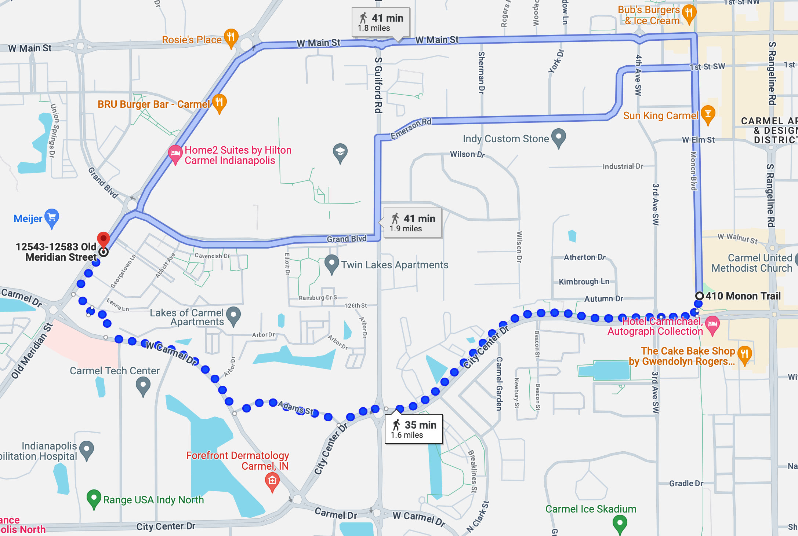
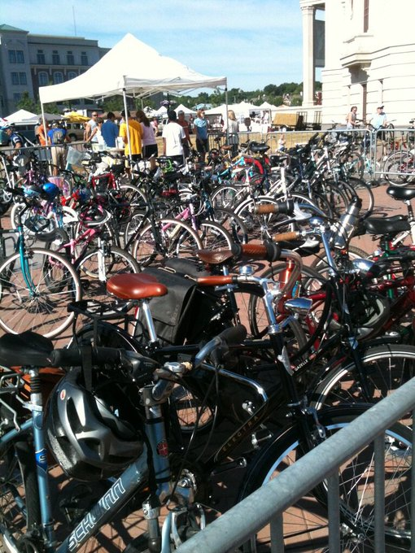

_This was originally written for [simpixelated.com](https://simpixelated.com) and reposted here with permission from the author._

One of my [goals for 2024](/year-end-review-2024/) was to "Get a small win with urbanist advocacy”. Throughout 2023 and 2024 I had been meeting with a small group of local bicycle and pedestrian advocates here in Carmel. One of our big ideas, inspired by a high school project by local Riley Choe, was building a new multi-use path in the center of Carmel, connecting to the existing (and amazing) Monon Trail.

I’m happy to announce that in part due to our advocacy, the project has been funded and scheduled for development, hopefully as early as 2026! From the [Current in Carmel](https://youarecurrent.com/2024/12/30/full-steam-ahead-mayor-plans-to-continue-robust-pace-of-progress-in-2025/):

> CCPR also expects to continue plans to expand its trail network. It is working with the city to create the Autumn Greenway, which will stretch east-west from Midtown/City Center to the Old Meridian Street corridor; and a north-south greenway connecting Autumn Greenway to Main Street. Land acquisition and planning is expected to occur in 2025, with development set to begin in 2026, according to CCPR Director Michael Klitzing.

## The Vision

### Connecting the urban cores of Carmel with a multi-use path

The proposal is to add a roughly one mile extension to the Monon Trail in Carmel. It would start from the trail, just north of City Center Drive, run mostly through vacant land, connecting neighborhoods along Autumn Drive and 126th Street, and eventually end at Old Meridian Street. This would provide a pleasant and safe connection to the farmer’s market, restaurants, groceries, and more, for thousands of residents who currently live just out of walking distance of the Monon Trail.

_Proposed route_

▶️ Watch [Riley's video](https://www.youtube.com/watch?v=nmqCMsSQ76Y) for a detailed breakdown

#### To connect neighborhoods

The Monon Trail is the centerpiece of Carmel, Indiana. It connects the city with Indianapolis to the south and Westfield to the north. On holidays, weekends, and warm weather months, people from all over use the trail for exercise, recreation, and to visit local businesses on Main Street, Midtown, City Center, and more.

> “The city’s Arts and Design District is centered around the Monon. Upscale Midtown, with nearly a billion dollars in development investment, rose because of it.” - [from IndyStar](https://www.indystar.com/story/news/local/2021/07/28/the-monon-trail-indianapolis-once-controversial-now-beloved/5324106001/)

The city also continues to spur development along Old Meridian (recently named the “[Flower District](https://youarecurrent.com/2023/12/07/carmel-unveils-plans-for-flower-district/)”). Unfortunately between these two urban cores, there is no direct path, especially for pedestrians or bicyclists.

_Route options for pedestrians crossing town_

A pedestrian going from Midtown to Old Meridian has to walk a half-mile out of their way, on narrow sidewalks alongside winding four-lane roads, across double lane roundabouts and watching for cars at every driveway. It’s inconvenient, stressful, and dangerous for anyone outside of a car. So despite being just a mile apart, most people choose to drive when traveling between these neighborhoods.

#### To reduce traffic

To help ease traffic congestion as the city continues to grow, we need more transportation options. The amount of bikes parked at the farmer’s market on any given summer weekend proves that people are willing to bike or walk when there is a safe and convenient way to do so.

_bike valet parking at Carmel Farmer’s Market_

The Monon Trail is amazing for traveling north and south, but we need more connections going east and west. We need more safe biking and walking infrastructure to encourage people to leave their car at home.

Everyone will benefit from fewer cars on the road, even those that never use this proposed path. For those that still choose to drive, they will encounter less traffic on the way and more parking spaces at their destination.

#### To provide more safe routes to school

Carmel Elementary, Carmel Middle, and Carmel High School are all within walking distance of the Monon Trail, but getting across town can be difficult and dangerous on foot or by bike. The Autumn Greenway will give students traveling east or west a safe option for a large portion of the trip.

For example, elementary age students living along Old Meridian could take the path, separated from cars, to the Monon Trail, and then across Rangeline around Midtown. High school students could do the same, taking the greenway to the Monon and then on to Main St. with minimal interactions with cars. Finally, students attending Carmel Middle School would have another option for getting to Guilford Road.

#### To benefit our local economy

It has been proven that multi-use paths like the Monon have a dramatically positive economic impact on the areas they connect. In fact, a [recent study](https://southernindianabusinessreport.com/2023/05/31/monon-south-brings-economic-health-benefits/) by Indiana University School of Public Health concluded "the net economic impact of trails and active transportation annually in Indiana is as much as $1.6 billion". Those benefits "increase exponentially as the connectivity between trails, people and places improves".

The Monon Trail has already stimulated more than a billion dollars in development investment in Carmel and [raised property values by at least 11%](https://www.indystar.com/story/news/local/2021/07/28/the-monon-trail-indianapolis-once-controversial-now-beloved/5324106001/) in Indianapolis. Properties along the Monon in Carmel are the "the [most sought-after properties](https://carmelmonthlymagazine.com/celebrating-two-decades-of-the-monon-greenway/)", making the trail the equivalent of ["beach-front property in Central Indiana"](https://carmelmonthlymagazine.com/celebrating-two-decades-of-the-monon-greenway/).

The Autumn Greenway will also likely improve property value for property owners along the new trail. It will increase the chance that people walking and biking will stop at a local business. It will provide another reason for tourists to visit Carmel. It will increase the likelihood that employees will want to relocate and stay in the area.

There are other indirect benefits of The Autumn Greenway for the local economy: the more people who choose to walk or bike instead of driving, will reduce the overall wear and tear on our roads. With fewer people on the road, the less chance of an accident, which is a drain on our emergency response and hospital systems. People wanting to enjoy a beer or two at Sun King will have another option to walk home safely, preventing possible drunk driving accidents.

#### To provide more green-space in the urban core

In addition to providing a path for active transportation, this extension would also provide a safe and calming place for people to walk their dog, exercise, and enjoy green-space. The cross-country teams at Carmel Clay Schools already use The Monon Trail for training as ["an alternative to busy streets and narrow sidewalks"](https://carmelmonthlymagazine.com/celebrating-two-decades-of-the-monon-greenway/). The Autumn Greenway will provide another (much needed) linear park within central Carmel.

#### To help achieve the city’s climate goals

Carmel’s Climate Action Plan outlines strategies for achieving net zero GHG emissions by 2050, including:

- [Encourage Multi-Modal Transportation and Walkability](https://climatecarmel.com/actions/T-1)
- [Expand Promotion of Bicycles as Alternative Mode of Transportation](https://climatecarmel.com/actions/T-6)
- [Promote Local Food Purchasing](https://climatecarmel.com/actions/FA-3)
- [Evaluate Farmers Market Potential for Accessibility](https://climatecarmel.com/actions/FA-7)

All of these could be addressed or improved by an extension to the Monon Trail. Because of it’s location (ending just north of City Center Drive), it will add low-stress access to the farmer’s market for many residents, which will encourage people to buy more local food, use multi-modal transportation, and make it easier to adopt bicycles as an alternative to driving.

### Design and Development Timeline

- 2022 - Riley created an [amazing video](https://youtu.be/nmqCMsSQ76Y) highlighting the problems that the Autumn Greenway could solve.
- 2023 - A small group of local bicycle advocates started meeting monthly, calling ourselves the The Carmel Transportation Party. Based on Riley’s video, the off-street trail (with the working title “Monon Extension”) was one of our main topics.
- Jan. 2024 - Newly elected city council member [Matt Snyder](https://www.carmel.in.gov/government/city-council/matt-snyder) joined our meeting and immediately wanted to help make the new trail a reality. He helped schedule a meeting with council member [Anita Joshi](https://www.carmel.in.gov/government/city-council/anita-joshi), the parks department, and the engineering department at the city.
- Spring 2024 - Jeremy Kashman investigated the project and made a final recommendation to Mayor Finkam for approval.
- October 2024 - The project had made it through the Land Use and Special Studies Committee with $9M budgeted to each section: the Autumn Greenway and Memorial Greenway (new northern spur). It was later approved by city council, as part of a much larger bond package.
- 2025 - Land acquisition and planning is expected to occur.
- 2026 - Development set to begin.
