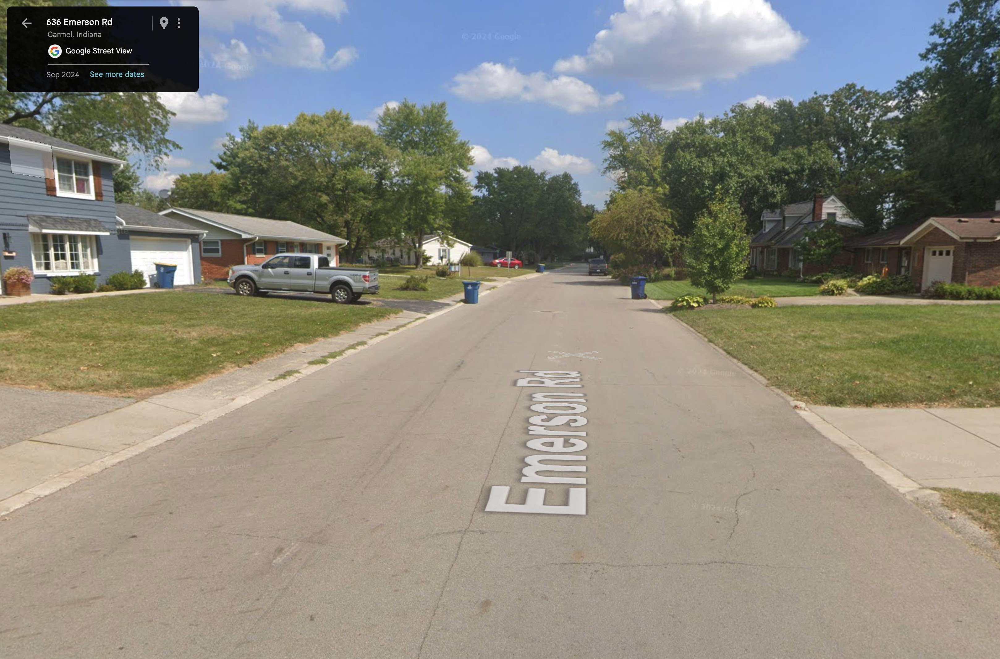

One morning last school year, while biking with my daughter to Carmel Middle School along Emerson Road, we were almost hit head-on, by a car turning into their own driveway. It was nobody’s fault.

They appeared to be stopped and waiting for me to pass. In retrospect, I realize they were staring directly into the morning sun and probably couldn’t see me at all. Right as I was passing them in the opposite direction, they turned towards my cargo bicycle with my daughter in the front, and I had to swerve out of the way just to avoid being hit. We probably wouldn’t have died, but it would have been traumatizing and expensive nonetheless.

The fault lies in the design of our streets. While many drivers are careful around pedestrians and cyclists, ultimately the risk still comes down to pure physics. There is an inherent danger when humans mix with 3,000 pound vehicles in our public spaces.

<figure class="figure">
  
  <figcaption class="figure-caption">Emerson Rd is not a great place to bike</figcaption>
</figure>

While we mostly accept this constant risk to our lives, Carmel has done more than most cities to improve safety with roundabouts, raised crosswalks, and separated trails. I cherish the safety that these off-street trails provides for myself and our community. The Monon is so safe that parents let their children walk and ride on it by themselves, every day. If I could have taken it west to my daughter’s school, I would have. But such a connection doesn't exist... yet!

## The Solution

<figure class="figure">
  
  <figcaption class="figure-caption">Proposed route for the Autumn Greenway (<a href="/blog/the-autumn-greenway/">learn more</a>)</figcaption>
</figure>

Having a direct connection separated from traffic is why I’m in favor of the [Autumn Greenway](/blog/the-autumn-greenway/). It will provide another off-street path that connects communities in Carmel with the amenities that already exist along The Monon.

<figure class="alert alert-primary">
  <blockquote class="blockquote">
    
One of the main reasons I suggested [the Autumn Greenway] was because I felt unsafe using Emerson Rd to bike down. It's very wide and has no curb bump-outs to narrow the street, so people in trucks would fly past me!

  </blockquote>
  <figcaption class="blockquote-footer">
    Riley Choe, <cite title="Source Title">Carmel High School grad</cite>
  </figcaption>
</figure>

Some in the community think this project is a bad investment for the city. They undervalue how much people want and need efficient, direct, and well-designed off-street paths like the Monon and Hagan-Burke trails. They think that routing bicyclists onto city streets with just some paint and signage is good enough.

While this is how many cities treat cycling infrastructure, this is not how Carmel does it. Carmel has become a destination thanks to the amazing design of of our extensive multi-use path network, which keeps cyclists and pedestrians separated from vehicular traffic. Along Monon Boulevard, this is combined with a beautiful design, pocket parks, and access to mixed-use developments that make it such a destination.

<blockquote class="twitter-tweet">
One thing I like about this idea for a new off street trail is that it was a citizen initiative. A member of the public came up with the idea and now it&#39;s a project that&#39;s likely to happen. <a href="https://t.co/pdlMLtAelL">https://t.co/pdlMLtAelL</a>
&mdash; Aaron M. Renn 🇺🇸 (@aaron_renn) <a href="https://twitter.com/aaron_renn/status/1925239587992940879?ref_src=twsrc%5Etfw">May 21, 2025</a></blockquote>  

## Show Your Support

If you agree that we shouldn't give up on the dream of an east-west Monon, that we shouldn't settle for less, then please join me in showing your support for the Autumn Greenway by signing [this letter](https://forms.gle/CZsRV4QaU3c8T3Qk8) to the Mayor and City Council of Carmel.

  

    
Show the city we want good walking/biking paths by signing this letter of support to the Mayor and City Council

    <a href="https://forms.gle/CZsRV4QaU3c8T3Qk8" class="btn btn-primary">Sign letter</a>
  

